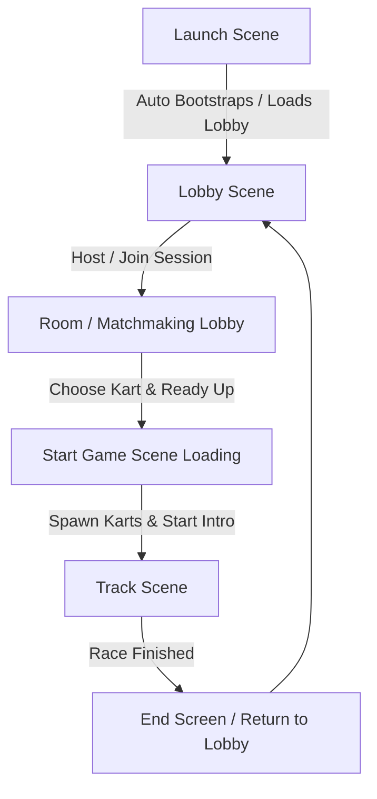

# Project Architecture & Developer Onboarding Guide

Welcome to the **Fusion Karts Demo** project. This document serves as a comprehensive onboarding resource to help you understand the game's system design, module organization, and networking flow, enabling you to get started immediately.

---

## 1. Project Overview

**Fusion Karts** is an arcade-style, multiplayer kart racing game developed in Unity. It features active physics-based driving, drifting mechanics with tiered boost rewards, item/powerup boxes, and lap tracking.

### Core Tech Stack
*   **Game Engine**: Unity 2020.3+ (utilizes the **New Input System**).
*   **Networking**: **Photon Fusion** (SDK version 1.x), using state synchronization, client-side input prediction, and server-authoritative physics simulation.
*   **UI System**: Unity UI (uGUI), Canvas faders, and **TextMeshPro** for crisp interface rendering.

---

## 2. Scenes & Game Flow

The game flow transitions sequentially through three distinct stages of scenes:

### Scene Breakdown
1.  **Launch** (`Assets/Scenes/Launch.unity`): Bootstraps the application, configures frame rates, spawns the persistent network launcher, and immediately loads the Lobby scene.
2.  **Lobby** (`Assets/Scenes/Lobby.unity`): Houses matchmaking screens (Region selection, Nickname entry, Create/Join Game, and the Room view where players select their karts and click "Ready").
3.  **Tracks** (`Assets/Scenes/Track01.unity`, `Track02.unity`): The actual gameplay stages. When a session starts, the server loads the selected track scene, spawns players' karts at spawn points, executes a pre-race camera flythrough, runs a count-down sequence, and then enables driving controls.

---

## 3. Modules & Core Classes

The project's code base is located under `Assets/Scripts/` and is divided into logical, modular subfolders.

### 3.1 Networking & Connection Management
Manages room registration, player list synchronization, network session states, and network object pooling.
*   **Path**: `Assets/Scripts/Networking/` & `Assets/Scripts/Fusion Helpers/`

| File / Class | Responsibility |
| :--- | :--- |
| **`GameLauncher.cs`** | Integrates with Photon Fusion `INetworkRunnerCallbacks`. Starts/joins sessions, handles connection timeouts, and initializes the network physics simulator and object pools. |
| **`RoomPlayer.cs`** | A networked behaviour representing a player in the session. Synchronizes username, selected kart ID, readiness, and game state (`Lobby`, `GameCutscene`, `GameReady`) across all clients. |
| **`ClientInfo.cs` / `ServerInfo.cs`** | Local static caches storing metadata for the current client (nickname, selected kart) and session configuration (lobby name, max players, selected track). |
| **`FusionObjectPoolRoot.cs` / `FusionObjectPool.cs`** | Provides high-performance recycled spawning of networked prefabs (karts, items, obstacles) to minimize GC allocation spikes during runtime. |

### 3.2 Managers
Global controllers managing game states, scenes, and shared asset collections.
*   **Path**: `Assets/Scripts/Managers/`

| File / Class | Responsibility |
| :--- | :--- |
| **`GameManager.cs`** | A persistent network manager tracking room-wide state (Track ID, game mode type) and regulating camera control via `ICameraController` delegation. |
| **`LevelManager.cs`** | Extends `NetworkSceneManagerDefault`. Automates UI transitions (loading screens/dummy faders) and triggers the track spawn sequences when loading gameplay levels. |
| **`ResourceManager.cs`** | Global scriptable reference registry containing lookup arrays for HUD prefabs, Karts, Tracks, and Powerups. |
| **`AudioManager.cs`** | Handles persistent background music playback transitions and provides UI/gameplay sound effects channels. |
| **`InterfaceManager.cs`** | Manages UI canvas layers, loading screens, and game pause screens. |

### 3.3 Kart System
Encapsulates all kart mechanics: physics, input capturing, audio, animation, and UI HUD updating.
*   **Path**: `Assets/Scripts/Kart/`

| File / Class | Responsibility |
| :--- | :--- |
| **`KartComponent.cs`** | Base class for kart sub-behaviours. Automatically links to the parent `KartEntity` and receives event notifications (`OnRaceStart`, `OnLapCompleted`, `OnEquipItem`). |
| **`KartEntity.cs`** | The central aggregator on the Kart prefab. Resolves references to sub-components and spawns the local HUD (`GameUI`) and nickname billboard for the local client. |
| **`KartController.cs`** | Core driving code. Simulates steering, acceleration, reverse, ground normal orientation (to align karts to steep track surfaces), drifting, and boostpad acceleration. |
| **`KartInput.cs`** | Collects Unity Input System inputs and bundles them into the tick-aligned `NetworkInputData` struct. |
| **`KartLapController.cs`** | tracks current lap, validates checkpoints, handles spawning back to the last checkpoint upon falling off track, and tracks final finish times. |
| **`KartItemController.cs`** | Manages powerup usage timeouts and triggers the active powerup ScriptableObject. |

### 3.4 Track & Environment
Defines path tracking, race progress validation, and dynamic hazard/boost elements on the circuit.
*   **Path**: `Assets/Scripts/Track/`

| File / Class | Responsibility |
| :--- | :--- |
| **`Track.cs`** | Defines checkpoints, spawn coordinates, and the camera flythrough trajectory data. Instantiates karts for all registered room players once loaded. |
| **`Checkpoint.cs`** | Collidable trigger zones placed along the track to track kart progression and prevent shortcut cheating. |
| **`FinishLine.cs`** | Triggers lap completion in `KartLapController` once a kart has sequentially crossed all checkpoints. |
| **`Boostpad.cs`** | Accelerates the kart into a higher boost tier when run over. |
| **`ItemBox.cs`** | Randomly rolls a powerup from `ResourceManager` for karts colliding with it. Enters a network-synchronized cooldown period before returning. |

### 3.5 Pickups & Powerups
Implements the mechanics for dynamic items that can be collected, equipped, and deployed.
*   **Path**: `Assets/Scripts/Pickups/`

| File / Class | Responsibility |
| :--- | :--- |
| **`Powerup.cs`** | ScriptableObject defining item configuration details (UI icon, name, and spawned prefab) and instantiating the active item in the world. |
| **`SpawnedPowerup.cs`** | Base networked class for objects placed in the world after usage (e.g. hazards). |
| **`BananaPowerup.cs`** | Hazard item that spins karts out on contact. Implements a spawn safety delay to prevent players from colliding with their own dropped items. |
| **`BoostPowerup.cs`** | An instantaneous acceleration boost that immediately despawns. |

---

## 4. Key Gameplay Mechanics & Network Design

Understanding these three designs is critical before editing core gameplay code:

### 4.1 Client-Side Prediction (CSP)
To feel responsive in multiplayer, karts utilize Fusion's Client-Side Prediction:
1.  **Input Collection**: In `KartInput.cs` (implements `INetworkRunnerCallbacks`), Unity's New Input System actions are read during `OnInput` and mapped to a local `NetworkInputData` struct.
2.  **Simulation Tick**: In `KartController.cs`, `FixedUpdateNetwork` reads the inputs via `GetInput(out KartInput.NetworkInputData input)`. 
3.  **Local vs Network**: The local client simulates movements instantly, while the server runs the authoritative simulation. If the server's state differs, the local client is automatically rolled back and re-simulated to match, providing zero-latency controls.

### 4.2 Drifting & Boost Tiering
Drifting is a key skill mechanic in the game:
*   Initiated by pressing the Drift button while steering.
*   `EvaluateDrift` calculates how long the kart remains in a drift state.
*   Upon release, the drift time is converted into one of the `driftTiers` (stored as structs in `KartController`). The player receives a speed boost for a duration corresponding to the reached tier (visually represented by colored wheel sparks).

### 4.3 Checkpoint Loop and Anti-Cheat
To complete a lap:
1.  A kart must pass checkpoints sequentially. `CheckpointIndex` tracks the last checkpoint index the player successfully touched.
2.  If the player tries to skip checkpoints and cross the `FinishLine`, it is ignored.
3.  If a player falls off the track or gets stuck, pressing the respawn button calls `ResetToCheckpoint()`, teleports the kart's rigidbody to the last successfully crossed checkpoint's coordinate, and halts all momentum.

---

## 5. Onboarding & Setup Guide

### 5.1 Setting up Photon Fusion
1.  Sign in or register at the [Photon Dashboard](https://dashboard.photonengine.com/).
2.  Create a new Application, selecting **Photon Fusion** as the App Type.
3.  Copy the generated **AppId**.
4.  In the Unity Editor, open the Photon Fusion Hub (`Window > Photon Fusion > Hub`).
5.  Paste your AppId into the configuration slot (this updates `PhotonAppSettings`).

### 5.2 Running Local Multiplayer Tests
Since the game requires networked interaction, test multiplayer with the following methods:
*   **ParrelSync (Recommended)**: Clone the project editor internally to run two Unity editor instances side-by-side.
*   **Standalone Build**: Create a standalone build (`File > Build Settings`). Run the built executable alongside the Unity editor.
    *   Set one instance to **Host** (Create Game).
    *   Set the other instance to **Client** (Join Game) and input the matching lobby name.

### 5.3 How to Extend the Game

#### Adding a New Kart prefab
1.  Create your 3D kart model.
2.  Add a `SphereCollider` at the pivot and attach the `KartEntity` component.
3.  Add all required components (`KartController`, `KartInput`, `KartAudio`, `KartAnimator`, `KartCamera`, `KartLapController`, `KartItemController`, `NetworkRigidbody3D`).
4.  Create a new `KartDefinition` ScriptableObject in `Assets/Scriptable Objects/` and assign your prefab.
5.  Register the definition in the `ResourceManager` component under the global persistent game object in the `Launch` scene.

#### Adding a New Track
1.  Design your track scene and ensure you include a `Track` component in your scene hierarchy.
2.  Define checkpoints in sequence and assign them to the `checkpoints` array on the `Track` script.
3.  Create a `TrackDefinition` ScriptableObject and register it in `ResourceManager`.
