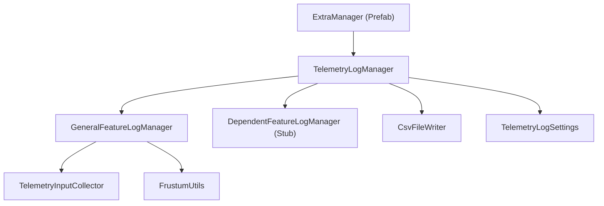
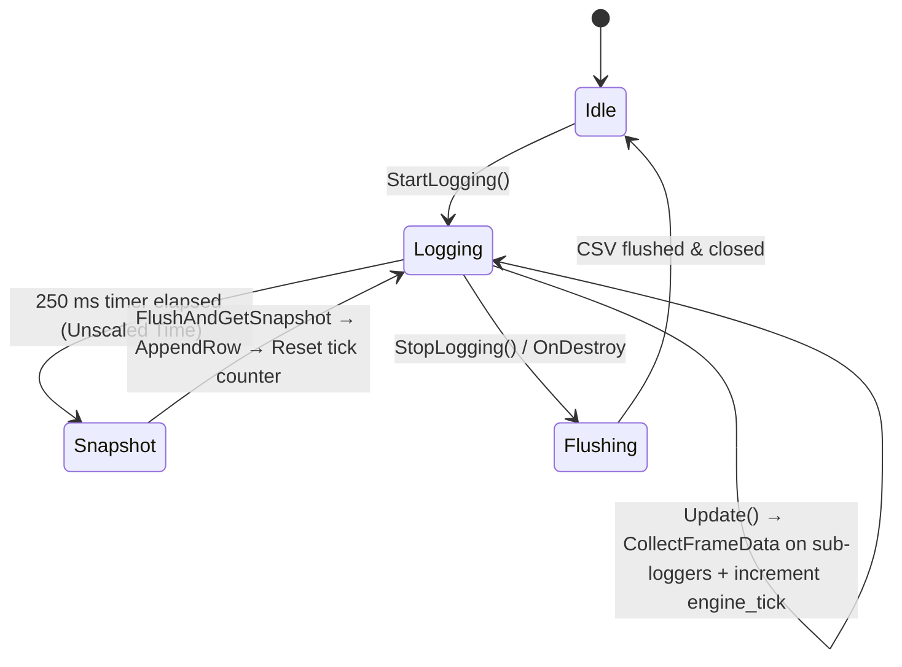
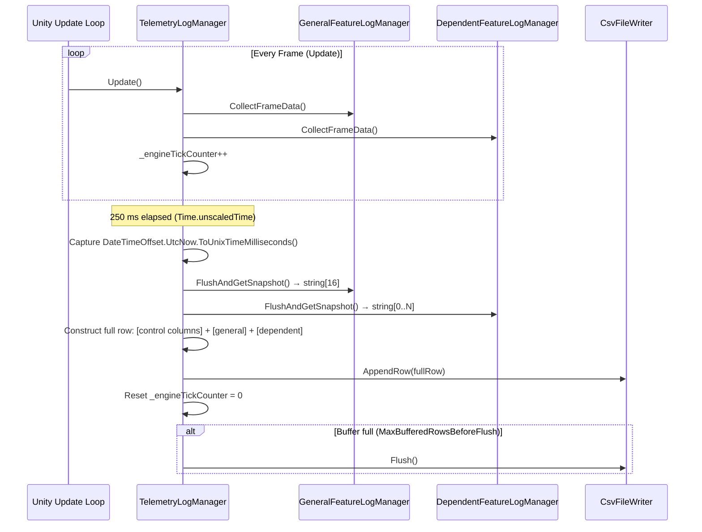
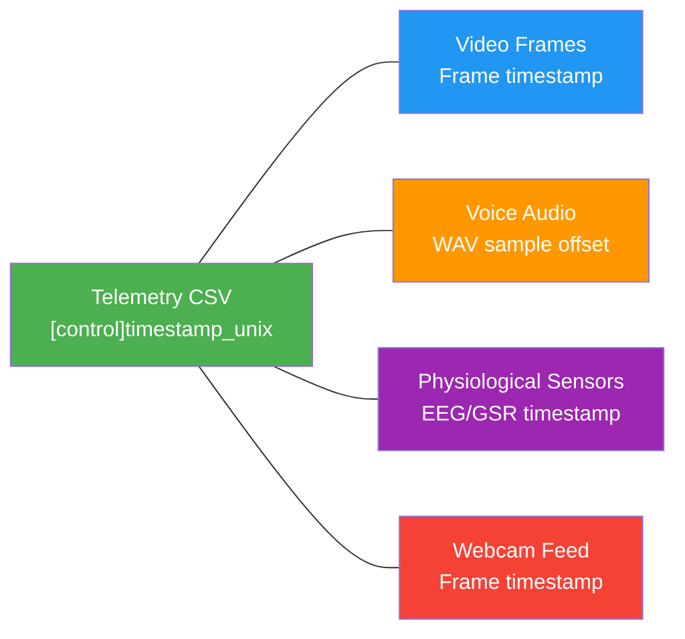

# Telemetry Log Module — Implementation Plan

> **Goal**: Build a fully modular, plug-and-play Telemetry Log module that lives entirely under `Assets/Extra/`. The module continuously samples gameplay state at a fixed **4 Hz** (every 250 ms) and writes structured **CSV** log files annotated with high-precision Unix timestamps for cross-modal synchronization with video, audio, and physiological sensor streams.

> [!IMPORTANT]
> This plan covers **TelemetryLogManager** and **GeneralFeatureLogManager** only. **DependentFeatureLogManager** is stubbed with empty/minimal interfaces — its per-game implementation is deferred to a future plan.

---

## 1. Architecture Overview

```
Assets/Extra/
├── Plan/
│   └── Implement_General_Telemetry_Log_Plan.md   ← (this file)
├── Prefabs/
│   └── ExtraManager.prefab                    ← Singleton prefab, drag into any scene
├── Resources/
│   └── TelemetryLog/                              ← Runtime output: saved .csv files
├── Scripts/
│   └── TelemetryLog/
│       ├── TelemetryLogManager.cs                 ← Main orchestrator (MonoBehaviour)
│       ├── GeneralFeatureLogManager.cs            ← General gameplay feature logger
│       ├── DependentFeatureLogManager.cs          ← Stub for game-specific feature logger
│       ├── TelemetryLogSettings.cs                ← [Serializable] config class for Inspector
│       ├── CsvFileWriter.cs                       ← CSV file I/O utility (header + append rows)
│       ├── ITelemetryProvider.cs                   ← Interface contract for any feature logger
│       ├── TelemetryInputCollector.cs              ← Cross-platform input abstraction (mobile / PC)
│       └── FrustumUtils.cs                         ← Camera frustum / screen-bounds gating utility
```

### Dependency Diagram



### Scene Hierarchy

```
ExtraManager                       ← Root GameObject (DontDestroyOnLoad)
├── TelemetryLogManager            ← Child, holds TelemetryLogManager component
│   ├── GeneralLogger              ← Child, holds GeneralFeatureLogManager component
│   └── DependentLogger            ← Child, holds DependentFeatureLogManager component
├── (VoiceChatManager)             ← Sibling module (existing)
└── (ScreenRecordingManager)       ← Sibling module (existing)
```

> [!IMPORTANT]
> The module has **zero dependencies** on the host project's scripts (no references to `KartEntity`, `GameManager`, Photon Fusion, etc.). It uses only built-in Unity APIs (`Camera`, `Input`, `SystemInfo`, `Transform`, `Renderer`, `Collider`). It can be copied into any Unity project as-is.

> [!NOTE]
> **Namespace**: All scripts live under `Extra.TelemetryLog` to mirror the `Extra.VoiceChat` / `Extra.ScreenRecording` conventions and avoid naming collisions.

---

## 2. Data Protocol & CSV Format

### 2.1 Naming Convention (Prefix Standard)

| Prefix | Usage | Examples |
|:-------|:------|:---------|
| `[control]` | Meta-variables, system controls, temporal anchors | `[control]timestamp_unix`, `[control]session_id`, `[control]engine_tick` |
| `[string]` | Categorical / state variables | `[string]device_type` |
| *(none)* | Standard numerical variables (float/int) | `movement`, `score`, `bot_count` |

### 2.2 Master CSV Header Row

The CSV header is constructed **once** at initialization by querying headers from both sub-loggers:

```
[control]timestamp_unix,[control]session_id,[string]device_type,[control]engine_tick,time_passed,<General Feature Columns...>,<Dependent Feature Columns...>
```

#### Full General Feature Columns (in order)

```
[control]timestamp_unix,[control]session_id,[string]device_type,[control]engine_tick,time_passed,input_intensity,input_diversity,idle_time,activity,movement,score,bot_count,bot_movement,bot_diversity,avg_bot_health,avg_bot_speed,avg_bot_distance,object_intensity,object_diversity,event_intensity,event_diversity
```

> [!NOTE]
> `[control]timestamp_unix` is a `long` value in UTC milliseconds (e.g., `1753105005123`), obtained via `System.DateTimeOffset.UtcNow.ToUnixTimeMilliseconds()`.

### 2.3 Example CSV Output

```csv
[control]timestamp_unix,[control]session_id,[string]device_type,[control]engine_tick,time_passed,input_intensity,input_diversity,idle_time,activity,movement,score,bot_count,bot_movement,bot_diversity,avg_bot_health,avg_bot_speed,avg_bot_distance,object_intensity,object_diversity,event_intensity,event_diversity
1753105005123,a1b2c3d4-e5f6-7890-abcd-ef1234567890,iPhone14_2,15,0.250,3,2,0.200,0.800,1.532,100,2,3.210,1,0.850,4.200,12.350,5,3,2,2
1753105005373,a1b2c3d4-e5f6-7890-abcd-ef1234567890,iPhone14_2,16,0.500,1,1,0.600,0.400,0.821,100,3,5.100,2,0.720,3.800,8.910,4,2,1,1
```

---

## 3. Core Interface — `ITelemetryProvider.cs`

**Purpose**: A shared contract that both `GeneralFeatureLogManager` and `DependentFeatureLogManager` (and any future sub-loggers) must implement. Allows `TelemetryLogManager` to query headers and snapshots uniformly.

```csharp
namespace Extra.TelemetryLog
{
    public interface ITelemetryProvider
    {
        /// <summary>
        /// Returns the CSV header columns this provider contributes.
        /// Called once during initialization to construct the master header.
        /// </summary>
        string[] GetHeaders();

        /// <summary>
        /// Called every frame (from Update). Accumulates per-frame data
        /// into internal buffers for the current 250 ms window.
        /// </summary>
        void CollectFrameData();

        /// <summary>
        /// Called every 250 ms tick. Computes aggregated values from
        /// accumulated frame data, returns them as CSV-ready string values
        /// (one per header column, same order), then resets internal accumulators.
        /// </summary>
        string[] FlushAndGetSnapshot();
    }
}
```

**Implementation Tasks**:
- [ ] Create as a C# `interface` in its own file `ITelemetryProvider.cs`.
- [ ] Both `GeneralFeatureLogManager` and `DependentFeatureLogManager` implement this interface.
- [ ] `FlushAndGetSnapshot()` must reset all per-window accumulators after returning values.
- [ ] `GetHeaders()` array length must always match `FlushAndGetSnapshot()` array length.

---

## 4. Detailed Script Specifications

---

### 4.1 `TelemetryLogSettings.cs` — Configuration

**Purpose**: Centralised, Inspector-tweakable settings for the telemetry log module.

| Field | Type | Default | Description |
|:------|:-----|:--------|:------------|
| `SamplingIntervalSeconds` | `float` | `0.25f` | Snapshot window duration. 4 Hz = every 250 ms. |
| `OutputFolderPath` | `string` | `"Assets/Extra/Resources/TelemetryLog"` | Relative project path where CSV files are saved. On Android, auto-switches to `Application.persistentDataPath + "/TelemetryLog"`. |
| `FileNamePrefix` | `string` | `"telemetry_"` | Prefix for saved files, e.g. `telemetry_20260721_204248.csv`. |
| `AutoStartOnAwake` | `bool` | `true` | Whether logging starts immediately when the manager initialises. |
| `EnableDebugLogs` | `bool` | `false` | Toggle verbose logging for development. |
| `MaxBufferedRowsBeforeFlush` | `int` | `40` | Number of CSV rows buffered in memory before flushing to disk (40 rows ≈ 10 seconds at 4 Hz). |

**Implementation Tasks**:
- [ ] Create as a `[System.Serializable]` class (matching `VoiceChatSettings` / `ScreenRecordingSettings` pattern).
- [ ] Add `[Tooltip]` attributes to every field.
- [ ] Add `[Range(0.05f, 2.0f)]` for `SamplingIntervalSeconds`.
- [ ] Add `[Range(10, 200)]` for `MaxBufferedRowsBeforeFlush`.
- [ ] Add a `string GetOutputPath()` method that returns `Application.persistentDataPath` on Android / `Assets/`-rooted path in Editor.
- [ ] Add a `void Validate()` method to clamp/fix invalid values at runtime.

---

### 4.2 `CsvFileWriter.cs` — CSV File I/O Utility

**Purpose**: Manages the lifecycle of a single CSV log file — creates it with a header row, appends data rows, flushes to disk, and handles file closure.

#### Key Fields & Methods

| Member | Description |
|:-------|:------------|
| `string FilePath { get; }` | Absolute path of the current CSV file. |
| `bool IsOpen { get; }` | Whether the writer currently has a file open. |
| `void Open(string filePath, string[] headerColumns)` | Creates the file, writes the header row as the first line (comma-separated). Creates parent directories if needed. |
| `void AppendRow(string[] values)` | Buffers a single CSV row in memory. `values` must match `headerColumns.Length`. |
| `void Flush()` | Writes all buffered rows to disk using `StreamWriter.Flush()`. |
| `void Close()` | Flushes remaining data and closes the file stream. |
| `static string SanitizeCsvValue(string value)` | Escapes commas and quotes inside string values. |

**Implementation Tasks**:
- [ ] Use `System.IO.StreamWriter` with `autoFlush = false` for performance (manual `Flush()` calls).
- [ ] `Open()` should call `System.IO.Directory.CreateDirectory()` for the parent folder.
- [ ] `AppendRow()` validates `values.Length == headerCount` — log error and skip row on mismatch.
- [ ] `SanitizeCsvValue()`: wrap values containing commas in double quotes; escape embedded quotes.
- [ ] `Close()` should be idempotent (calling it multiple times is safe).
- [ ] Make this a plain C# class (not MonoBehaviour).
- [ ] Thread safety: all writes happen on the main thread, so no locking needed.
- [ ] Handle `IOException` gracefully — log error, don't crash the game.

---

### 4.3 `TelemetryInputCollector.cs` — Cross-Platform Input Abstraction

**Purpose**: Provides a unified API for collecting input metrics that works on both mobile (touch) and PC Editor (keyboard/mouse). Used by `GeneralFeatureLogManager` to populate input-related features without platform-specific code in the logger.

#### Key Fields & Methods

| Member | Description |
|:-------|:------------|
| `int InputIntensity { get; }` | Accumulated count of discrete input events this window. |
| `int InputDiversity { get; }` | Count of unique input types used this window. |
| `float IdleFraction { get; }` | Fraction of frames with zero input [0.0 – 1.0]. |
| `void CollectFrame()` | Called every frame. Records current-frame input state. |
| `void Flush()` | Computes final values, resets accumulators. |

#### Platform Strategy

```csharp
void CollectFrame()
{
#if UNITY_IOS || UNITY_ANDROID
    // Mobile: Input.touchCount, Input.GetTouch(), TouchPhase.Began
    // Track joystick drag, button tap, swipe as distinct input types
#else
    // PC Editor: Input.GetMouseButton(), Input.anyKeyDown
    // Track unique keys pressed via Input.inputString + mouse buttons
#endif
}
```

**Implementation Tasks**:
- [ ] Use `#if UNITY_IOS || UNITY_ANDROID` for mobile touch paths.
- [ ] Use `#if UNITY_EDITOR || UNITY_STANDALONE` fallback for mouse + keyboard.
- [ ] Track `inputIntensity` as a running count of `TouchPhase.Began` (mobile) or `GetMouseButtonDown` + `GetKeyDown` (PC).
- [ ] Track `inputDiversity` using a `HashSet<string>` of input type tags (e.g., `"touch_tap"`, `"joystick_drag"`, `"key_W"`, `"mouse_left"`). Clear on flush.
- [ ] Track `idleFraction` as `framesWithZeroInput / totalFramesInWindow`.
- [ ] Make this a plain C# class (not MonoBehaviour).

---

### 4.4 `FrustumUtils.cs` — Camera Frustum / Screen-Bounds Gating

**Purpose**: Static utility to determine whether a `Transform` or `Renderer` is visible within the main camera's frustum / screen viewport. Implements the **Spatial Gating Rule**: dynamic entities are only counted when inside the active screen view bounds.

#### Key Methods

| Method | Description |
|:-------|:------------|
| `static bool IsVisibleToCamera(Renderer renderer, Camera camera)` | Returns `true` if any part of the renderer's bounds is inside the camera's frustum. Uses `GeometryUtility.TestPlanesAABB`. |
| `static bool IsVisibleToCamera(Transform transform, Camera camera)` | Point-based visibility check using `Camera.WorldToViewportPoint`. Returns `true` if the transform's position falls within [0,1] viewport range and is in front of the camera. |
| `static Plane[] GetFrustumPlanes(Camera camera)` | Caches and returns the camera's frustum planes (recalculated once per 250 ms tick, not per entity). |

**Implementation Tasks**:
- [ ] Cache `GeometryUtility.CalculateFrustumPlanes(camera)` result per snapshot tick (avoid recalculating for every entity).
- [ ] Provide both `Renderer`-based (AABB) and `Transform`-based (point) overloads.
- [ ] Handle `Camera.main` being null gracefully (log warning, return `false`).
- [ ] Make this a `static` utility class.

---

### 4.5 `GeneralFeatureLogManager.cs` — General Gameplay Feature Logger

**Purpose**: A `MonoBehaviour` that implements `ITelemetryProvider`. Collects, aggregates, and reports general gameplay features common to any game, across every 250 ms sampling window.

#### Component Placement

Lives on the `GeneralLogger` child GameObject under `TelemetryLogManager`.

#### Feature Taxonomy — Headers & Accumulation Logic

##### A. Session, Device & System Metadata (collected by TelemetryLogManager, NOT this class)

These control columns (`[control]timestamp_unix`, `[control]session_id`, `[string]device_type`, `[control]engine_tick`, `time_passed`) are managed directly by `TelemetryLogManager` and prepended to every row. `GeneralFeatureLogManager` does **not** include them in its `GetHeaders()`.

##### B. Touch & Mobile Input Dynamics

| Header | Type | Accumulation Strategy |
|:-------|:-----|:----------------------|
| `input_intensity` | int | **Sum** of discrete input events across all frames in the window. |
| `input_diversity` | int | **Count** of unique input types seen across the window. |
| `idle_time` | float | **Fraction** [0.0–1.0] of frames with zero input. |
| `activity` | float | `1.0 - idle_time` (computed at flush). |

Delegated to `TelemetryInputCollector`.

##### C. Movement & Spatial Metrics

| Header | Type | Accumulation Strategy |
|:-------|:-----|:----------------------|
| `movement` | float | **Cumulative** distance traveled by the player `Transform` over the window (`Vector3.Distance` frame-over-frame). |
| `score` | float | **Snapshot** of current score at the instant of the 250 ms tick (point-in-time, not accumulated). |

**Player Detection**: `GeneralFeatureLogManager` locates the local player by searching for a `GameObject` tagged `"Player"` (Unity's default tag). If the project uses a different convention, the tag is configurable via a serialized field.

##### D. Bot / AI Telemetry (Spatial-Gated)

| Header | Type | Accumulation Strategy |
|:-------|:-----|:----------------------|
| `bot_count` | int | **Snapshot** count of visible enemy GameObjects tagged `"Enemy"` within the camera frustum at tick time. |
| `bot_movement` | float | **Cumulative** summed movement distance of all visible bots over the window. |
| `bot_diversity` | int | **Snapshot** count of distinct bot type names (via component name or a configurable tag/layer convention) among visible bots. |
| `avg_bot_health` | float | **Snapshot** mean health % of visible bots. Defaults to `0.0` if no health component found. |
| `avg_bot_speed` | float | **Snapshot** mean velocity magnitude of visible bots. |
| `avg_bot_distance` | float | **Snapshot** mean distance between player and each visible bot. |

**Bot Detection**: Uses `GameObject.FindGameObjectsWithTag("Enemy")` + `FrustumUtils.IsVisibleToCamera()` gating. The tag is configurable via a serialized field `[SerializeField] private string enemyTag = "Enemy"`.

**Bot Type Diversity**: Determined by `gameObject.name` prefix or a user-assigned `botTypeName` string component. If no custom component exists, falls back to `gameObject.name`.

**Health / Speed**: Attempts to find a component via `GetComponent<>()` with known interface names. If not found, defaults to `0.0`. The logger uses a **duck-typing / reflection-free** approach:
- Expose a `System.Func<GameObject, float>` delegate (`BotHealthProvider`, `BotSpeedProvider`) on the manager that game-specific code can set at runtime.
- If no delegate is set, defaults to `0.0` (graceful degradation).

##### E. Game Objects & Environment Telemetry (Spatial-Gated)

| Header | Type | Accumulation Strategy |
|:-------|:-----|:----------------------|
| `object_intensity` | int | **Snapshot** count of visible interactable GameObjects on a configurable layer (e.g., `"Interactable"`) within the camera frustum. |
| `object_diversity` | int | **Snapshot** count of distinct interactable object type names among visible objects. |

**Object Detection**: Uses `Physics.OverlapSphere` + layer mask, or tag-based `FindGameObjectsWithTag`, filtered by `FrustumUtils`. Layer/tag is configurable.

##### F. Event Telemetry

| Header | Type | Accumulation Strategy |
|:-------|:-----|:----------------------|
| `event_intensity` | int | **Sum** of gameplay events logged via `LogEvent(string eventType)` across the window. |
| `event_diversity` | int | **Count** of unique event type strings logged via `LogEvent()` across the window. |

**Event Collection**: The logger exposes a public static method `GeneralFeatureLogManager.LogEvent(string eventType)` that external game code can call to register events (e.g., `"shot_fired"`, `"item_collected"`, `"damage_taken"`). Internally uses a `List<string>` accumulator + `HashSet<string>` for diversity.

#### Key Fields & Methods

| Member | Description |
|:-------|:------------|
| `[SerializeField] string playerTag` | Tag used to locate the local player (`"Player"` default). |
| `[SerializeField] string enemyTag` | Tag used to locate enemies (`"Enemy"` default). |
| `[SerializeField] string interactableTag` | Tag used to locate interactable objects (`"Interactable"` default). |
| `Func<GameObject, float> BotHealthProvider` | External delegate for reading bot health. |
| `Func<GameObject, float> BotSpeedProvider` | External delegate for reading bot speed. |
| `Func<float> ScoreProvider` | External delegate for reading current score. |
| `string[] GetHeaders()` | Returns the 16 general feature column names. |
| `void CollectFrameData()` | Called every Update. Accumulates input, movement, bot movement. |
| `string[] FlushAndGetSnapshot()` | Called every 250 ms. Computes spatial-gated snapshots, averages, returns CSV values, resets. |
| `static void LogEvent(string eventType)` | Public API for external code to register gameplay events. |

**Implementation Tasks**:
- [ ] Implement as a `MonoBehaviour` that also implements `ITelemetryProvider`.
- [ ] In `Awake()` / first `CollectFrameData()`, cache `Camera.main` reference. Re-acquire each tick (handle scene transitions).
- [ ] In `CollectFrameData()` (called every frame):
  - [ ] Accumulate player movement: `_windowMovement += Vector3.Distance(currentPos, _lastPlayerPos)`.
  - [ ] Accumulate visible bot movement (per-bot position tracking via `Dictionary<int, Vector3>` keyed by instance ID).
  - [ ] Delegate to `TelemetryInputCollector.CollectFrame()`.
  - [ ] Increment `_frameCountInWindow`.
- [ ] In `FlushAndGetSnapshot()` (called every 250 ms tick):
  - [ ] Find player by tag. If null, fill movement/score with `0`.
  - [ ] Perform frustum-gated enemy scan: `FindGameObjectsWithTag(enemyTag)` → `FrustumUtils.IsVisibleToCamera()` filter.
  - [ ] Compute `bot_count`, `bot_diversity`, `avg_bot_health`, `avg_bot_speed`, `avg_bot_distance` from visible set.
  - [ ] Perform frustum-gated interactable scan: `FindGameObjectsWithTag(interactableTag)` → filter.
  - [ ] Compute `object_intensity`, `object_diversity`.
  - [ ] Compute `event_intensity`, `event_diversity` from accumulated event list.
  - [ ] Flush `TelemetryInputCollector` → get `input_intensity`, `input_diversity`, `idle_time`, `activity`.
  - [ ] Format all values as strings (floats to 3 decimal places: `value.ToString("F3")`).
  - [ ] Reset all per-window accumulators (`_windowMovement = 0`, clear event lists, clear bot position cache, etc.).
  - [ ] Return `string[16]` in header order.
- [ ] Handle graceful degradation: if player/enemies/objects don't exist (e.g., menu scene), return `0` for all fields. Never throw.
- [ ] `LogEvent()` is `static` so it can be called from anywhere without a reference.

---

### 4.6 `DependentFeatureLogManager.cs` — Game-Specific Feature Logger (Stub)

**Purpose**: A `MonoBehaviour` stub that implements `ITelemetryProvider` with empty implementations. Acts as the extension point for game-specific telemetry features to be implemented per-project in the future.

#### Component Placement

Lives on the `DependentLogger` child GameObject under `TelemetryLogManager`.

#### Stub Implementation

```csharp
namespace Extra.TelemetryLog
{
    public class DependentFeatureLogManager : MonoBehaviour, ITelemetryProvider
    {
        public string[] GetHeaders()
        {
            // No game-specific columns yet.
            return System.Array.Empty<string>();
        }

        public void CollectFrameData()
        {
            // No-op: implement per-project.
        }

        public string[] FlushAndGetSnapshot()
        {
            // No-op: implement per-project.
            return System.Array.Empty<string>();
        }
    }
}
```

**Implementation Tasks**:
- [ ] Create as a `MonoBehaviour` implementing `ITelemetryProvider`.
- [ ] All methods return empty/no-op by default.
- [ ] Add XML doc comments explaining the extension pattern.
- [ ] When a game project implements this, they override / extend the class with game-specific columns.

---

### 4.7 `TelemetryLogManager.cs` — Main Orchestrator (MonoBehaviour)

**Purpose**: The central MonoBehaviour that lives on a child of `ExtraManager`. Owns the 4 Hz sampling loop, coordinates `GeneralFeatureLogManager` and `DependentFeatureLogManager`, constructs and writes the master CSV file.

#### Component Placement

Lives on the `TelemetryLogManager` child GameObject under `ExtraManager`. Has two children: `GeneralLogger` and `DependentLogger`.

#### Inspector-Exposed Config

```csharp
[Header("Telemetry Log Settings")]
[SerializeField] private TelemetryLogSettings settings = new TelemetryLogSettings();
```

#### Lifecycle & Flow



#### Execution Loop Detail



#### Key Fields & Methods

| Member | Description |
|:-------|:------------|
| `TelemetryLogSettings settings` | Inspector-exposed configuration. |
| `GeneralFeatureLogManager _generalLogger` | Reference to GeneralLogger child. |
| `DependentFeatureLogManager _dependentLogger` | Reference to DependentLogger child. |
| `CsvFileWriter _csvWriter` | The active CSV file writer instance. |
| `string _sessionId` | Generated once via `System.Guid.NewGuid().ToString()` at `StartLogging()`. |
| `string _deviceType` | Captured once via `SystemInfo.deviceModel` at startup. |
| `int _engineTickCounter` | Frame counter, reset every 250 ms. |
| `float _timePassed` | Cumulative elapsed gameplay time since session start. |
| `float _lastSnapshotTime` | `Time.unscaledTime` at the last snapshot. |
| `bool IsLogging { get; }` | Read-only logging state. |
| `Awake()` | Finds/creates child GameObjects (`GeneralLogger`, `DependentLogger`). Attaches components. |
| `StartLogging()` | Generates `_sessionId`, captures `_deviceType`, creates `CsvFileWriter`, writes header row, starts timer loop. |
| `StopLogging()` | Flushes CSV, closes file, resets state. |
| `Update()` | Calls `CollectFrameData()` on both sub-loggers. Increments `_engineTickCounter`. Checks if 250 ms has elapsed → snapshot. |
| `void TakeSnapshot()` | Captures timestamp, queries sub-loggers, constructs row, appends to CSV. |
| `OnApplicationPause(bool)` | Flush on pause, resume on unpause. |
| `OnApplicationQuit()` | Calls `StopLogging()`. |
| `OnDestroy()` | Calls `StopLogging()`. |

#### Control Column Construction (per row)

```csharp
// 5 control columns prepended to every row
string[] controlColumns = new string[]
{
    DateTimeOffset.UtcNow.ToUnixTimeMilliseconds().ToString(),  // [control]timestamp_unix
    _sessionId,                                                  // [control]session_id
    _deviceType,                                                 // [string]device_type
    _engineTickCounter.ToString(),                               // [control]engine_tick
    _timePassed.ToString("F3")                                   // time_passed
};
```

**Implementation Tasks**:
- [ ] Implement singleton pattern (self-contained, matching VoiceChatManager / ScreenRecordingManager pattern).
- [ ] In `Awake()`, create/find `GeneralLogger` and `DependentLogger` child GameObjects and attach their respective components.
- [ ] `_sessionId = System.Guid.NewGuid().ToString()` — generated once per `StartLogging()` call.
- [ ] `_deviceType = SystemInfo.deviceModel` — sanitize commas/quotes for CSV safety.
- [ ] Use `Time.unscaledTime` for the 250 ms timer (immune to `Time.timeScale` changes / game pauses).
- [ ] `_timePassed` uses `Time.unscaledTime - _sessionStartTime` for cumulative elapsed time.
- [ ] CSV file name format: `{prefix}{yyyyMMdd}_{HHmmss}.csv` (one file per session).
- [ ] CSV header constructed by concatenating: `controlHeaders + generalLogger.GetHeaders() + dependentLogger.GetHeaders()`.
- [ ] Each `TakeSnapshot()`:
  1. Capture `DateTimeOffset.UtcNow.ToUnixTimeMilliseconds()`.
  2. Call `FlushAndGetSnapshot()` on both sub-loggers.
  3. Concatenate `controlColumns + generalValues + dependentValues`.
  4. Call `_csvWriter.AppendRow(fullRow)`.
  5. Reset `_engineTickCounter = 0`.
  6. If buffered rows ≥ `MaxBufferedRowsBeforeFlush`, call `_csvWriter.Flush()`.
- [ ] On `StopLogging()`: flush + close `CsvFileWriter`, then `#if UNITY_EDITOR AssetDatabase.Refresh() #endif`.
- [ ] Handle `OnApplicationPause(true)` → flush CSV to disk (don't close, in case we resume).
- [ ] Handle `OnApplicationQuit()` → `StopLogging()`.
- [ ] Provide public `StartLogging()` / `StopLogging()` for external control.
- [ ] Add a public event `System.Action<string> OnLogFileSaved` that fires when the CSV is finalized (on stop/destroy).

---

## 5. Prefab Setup — `ExtraManager.prefab`

### Hierarchy

```
ExtraManager                           ← Root (DontDestroyOnLoad component)
└── TelemetryLog                       ← Child (TelemetryLogManager component)
    ├── GeneralLogger                  ← Child (GeneralFeatureLogManager component)
    └── DependentLogger                ← Child (DependentFeatureLogManager component)
```

### Setup Tasks

- [ ] Create an empty child GameObject `TelemetryLog` under `ExtraManager`.
- [ ] Attach `TelemetryLogManager` component to `TelemetryLog`.
- [ ] Create child `GeneralLogger` under `TelemetryLog`. Attach `GeneralFeatureLogManager`.
- [ ] Create child `DependentLogger` under `TelemetryLog`. Attach `DependentFeatureLogManager`.
- [ ] Configure default Inspector values (250 ms interval, auto-start, debug logs off).
- [ ] Save/update prefab at `Assets/Extra/Prefabs/TelemetryLog/ExtraManager.prefab`.
- [ ] The root `ExtraManager` already has `DontDestroyOnLoad`, so child objects persist automatically.

**Usage**: Drag `ExtraManager.prefab` into **any** scene in any project. Telemetry logging starts automatically on Play at 4 Hz.

> [!NOTE]
> The `TelemetryLogManager` **does not** call `DontDestroyOnLoad` on itself — it relies on the parent `ExtraManager` having `DontDestroyOnLoad`, which preserves the entire hierarchy including children.

---

## 6. File Naming & Output Convention

| Component | Format | Example |
|:----------|:-------|:--------|
| Prefix | Configurable | `telemetry_` |
| Date | `yyyyMMdd` | `20260721` |
| Time | `HHmmss` | `204248` |
| Extension | `.csv` | `.csv` |
| **Full name** | | `telemetry_20260721_204248.csv` |

**Output directory (Editor)**: `Assets/Extra/Resources/TelemetryLog/`
**Output directory (Android)**: `<Application.persistentDataPath>/TelemetryLog/`

### File Size Estimates

| Duration | Rows | Approx. Size |
|:---------|:-----|:-------------|
| 1 minute | 240 | ~25 KB |
| 10 minutes | 2,400 | ~250 KB |
| 1 hour | 14,400 | ~1.5 MB |

> CSV files are extremely lightweight. Disk usage is negligible.

---

## 7. Edge Cases & Robustness

- [x] **No player found (menu/loading scenes)**: All player-dependent metrics default to `0`. The logger does not throw — it simply records zero-state rows.
- [x] **No enemies/objects found**: Bot and object metrics default to `0`. This is normal for scenes without enemies.
- [x] **Camera.main is null (scene transition)**: `FrustumUtils` returns `false` for all entities. All spatial-gated metrics default to `0`. Re-acquire camera on next tick.
- [x] **Game paused (Time.timeScale = 0)**: The timer uses `Time.unscaledTime`, so 4 Hz sampling continues even when the game is paused. This is intentional — we want to capture pause behavior.
- [x] **Application pause/resume (mobile)**: Flush CSV to disk on pause. Resume logging on unpause. No data loss.
- [x] **Application quit**: `StopLogging()` flushes and closes the CSV. `OnApplicationQuit` and `OnDestroy` both call `StopLogging()` (idempotent).
- [x] **Scene transitions**: `DontDestroyOnLoad` on `ExtraManager` preserves the entire hierarchy. Player/enemy references are re-acquired each tick.
- [x] **High frame rate (120+ fps)**: `_engineTickCounter` can be large. This is expected — the column captures the exact number of frames in each window.
- [x] **Low frame rate (<4 fps)**: If a frame takes >250 ms, the snapshot fires on the next frame. `_engineTickCounter` may be `1`. The timer catches up naturally.
- [x] **Disk write failure**: `CsvFileWriter` catches `IOException`, logs error, continues buffering. Does not crash.
- [x] **FindGameObjectsWithTag returns empty**: This is handled as zero-count. No exceptions. Tags that don't exist throw `UnityException` — catch and log a one-time warning, then disable that scan.
- [x] **Thread safety**: All operations happen on the main thread. No background threads needed for CSV writing at 4 Hz.

---

## 8. Implementation Checklist (TODO)

### Phase 1: Foundation & Settings
- [x] Create folder structure: `Scripts/TelemetryLog/`, `Prefabs/TelemetryLog/`, `Resources/TelemetryLog/`
- [x] Implement `ITelemetryProvider.cs` — interface with `GetHeaders()`, `CollectFrameData()`, `FlushAndGetSnapshot()`
- [x] Implement `TelemetryLogSettings.cs` — `[Serializable]` config class with `[Tooltip]` and `[Range]` attributes
- [x] Implement `CsvFileWriter.cs` — Open/AppendRow/Flush/Close with `StreamWriter`
- [x] Test `CsvFileWriter`: create a file, write 100 rows, verify CSV format is valid

### Phase 2: Utilities
- [x] Implement `FrustumUtils.cs` — static frustum plane caching + `IsVisibleToCamera()` overloads
- [x] Implement `TelemetryInputCollector.cs` — cross-platform input collection with `#if` guards
- [x] Test `FrustumUtils`: place objects in/out of camera view, verify visibility checks
- [x] Test `TelemetryInputCollector`: verify touch/mouse/key counting in Editor

### Phase 3: General Feature Logger
- [x] Implement `GeneralFeatureLogManager.cs` — MonoBehaviour + ITelemetryProvider
- [x] Implement `GetHeaders()` returning 16 column names in order
- [x] Implement `CollectFrameData()` — per-frame accumulators for movement, input, bot movement
- [x] Implement `FlushAndGetSnapshot()` — spatial-gated scans, averages, CSV formatting, accumulator reset
- [x] Implement `LogEvent()` static method for external event registration
- [x] Implement configurable delegate providers (`ScoreProvider`, `BotHealthProvider`, `BotSpeedProvider`)
- [x] Test standalone: create a scene with tagged Player/Enemy/Interactable objects, verify all 16 columns produce correct values
- [x] Test graceful degradation: run in an empty scene, verify all columns return `0` without errors

### Phase 4: Dependent Feature Logger (Stub)
- [x] Implement `DependentFeatureLogManager.cs` — MonoBehaviour + ITelemetryProvider with empty implementations
- [x] Add XML doc comments explaining the extension pattern
- [x] Verify: returns empty headers and empty snapshots

### Phase 5: Manager Integration
- [x] Implement `TelemetryLogManager.cs` — wire all components together
- [x] Implement singleton pattern (self-contained, no project dependencies)
- [x] Implement `Awake()` — create/find child GameObjects and attach sub-logger components
- [x] Implement `StartLogging()` — generate session ID, open CSV, write header, start timer
- [x] Implement `Update()` — frame-level collection + 250 ms timer check
- [x] Implement `TakeSnapshot()` — capture timestamp, query sub-loggers, construct row, append to CSV
- [x] Implement `StopLogging()` — flush, close CSV, `#if UNITY_EDITOR AssetDatabase.Refresh() #endif`
- [x] Implement `OnApplicationPause` / `OnApplicationQuit` / `OnDestroy` handlers
- [x] Add `[Header]` and `[Tooltip]` attributes to all serialized fields
- [x] Test: run for 1 minute (240 rows at 4 Hz), verify CSV file has correct header + 240 data rows

### Phase 6: Prefab & Polish
- [x] Create `ExtraManager` prefab with `TelemetryLogManager` + child loggers hierarchy
- [x] Set default Inspector values (250 ms, auto-start, debug off)
- [x] Test: drop prefab into a blank scene, press Play, verify CSV file appears with correct 4 Hz sampling
- [x] Test: verify logging survives scene transitions
- [x] Test: verify CSV is flushed and closed on Play Mode stop
- [x] Test: verify `[control]timestamp_unix` values are valid Unix milliseconds
- [x] Test: verify `[control]engine_tick` values are reasonable (e.g., ~15 at 60 fps over 250 ms)
- [x] Test: verify `[control]session_id` is consistent across all rows in a session
- [x] Profile: verify overhead is < 1ms per frame at 4 Hz sampling

### Phase 7: Portability Verification
- [x] Copy `Assets/Extra/` folder into a fresh empty Unity project
- [x] Verify it compiles with zero errors and zero warnings
- [x] Verify logging works out of the box in Editor (macOS / Windows)
- [x] Verify namespace isolation (`Extra.TelemetryLog`) — no collisions with `Extra.VoiceChat` / `Extra.ScreenRecording`
- [x] Verify CSV output is valid and parseable by external tools (Python pandas, Excel)

---

## 9. API Reference (Public Surface)

```csharp
namespace Extra.TelemetryLog
{
    // --- TelemetryLogManager ---
    public class TelemetryLogManager : MonoBehaviour
    {
        public static TelemetryLogManager Instance { get; }

        public bool IsLogging { get; }

        /// <summary>
        /// Fired on the main thread when the log file is finalized (on stop/destroy).
        /// Returns the absolute path to the saved CSV file.
        /// </summary>
        public event System.Action<string> OnLogFileSaved;

        public void StartLogging();
        public void StopLogging();
    }

    // --- GeneralFeatureLogManager ---
    public class GeneralFeatureLogManager : MonoBehaviour, ITelemetryProvider
    {
        /// <summary>
        /// External delegate for reading bot health (returns 0-1 normalized).
        /// Set by game-specific code at runtime.
        /// </summary>
        public System.Func<GameObject, float> BotHealthProvider { get; set; }

        /// <summary>
        /// External delegate for reading bot speed (returns velocity magnitude).
        /// </summary>
        public System.Func<GameObject, float> BotSpeedProvider { get; set; }

        /// <summary>
        /// External delegate for reading the current score.
        /// </summary>
        public System.Func<float> ScoreProvider { get; set; }

        /// <summary>
        /// Register a gameplay event for the current 250 ms window.
        /// Can be called from anywhere (static).
        /// </summary>
        public static void LogEvent(string eventType);
    }

    // --- ITelemetryProvider ---
    public interface ITelemetryProvider
    {
        string[] GetHeaders();
        void CollectFrameData();
        string[] FlushAndGetSnapshot();
    }
}
```

> [!TIP]
> External scripts interact primarily with `TelemetryLogManager.Instance` to start/stop logging, and `GeneralFeatureLogManager.LogEvent()` to register gameplay events. All internal classes (`CsvFileWriter`, `TelemetryInputCollector`, `FrustumUtils`) are `internal` — they are implementation details.

> [!TIP]
> To integrate game-specific metrics (score, bot health, bot speed), set the provider delegates on `GeneralFeatureLogManager` during your game's initialization:
> ```csharp
> var general = TelemetryLogManager.Instance.GetComponentInChildren<GeneralFeatureLogManager>();
> general.ScoreProvider = () => GameManager.Instance.CurrentScore;
> general.BotHealthProvider = (go) => go.GetComponent<EnemyHealth>()?.NormalizedHealth ?? 0f;
> general.BotSpeedProvider = (go) => go.GetComponent<Rigidbody>()?.velocity.magnitude ?? 0f;
> ```

---

## 10. Cross-Modal Synchronization Guide

The `[control]timestamp_unix` column enables precise temporal alignment with external data streams:



| Data Source | Sync Method |
|:------------|:------------|
| **Screen Recording** (this project) | Match `[control]timestamp_unix` with frame `metadata.json` `createdAt` field |
| **Voice Chat** (this project) | Match `[control]timestamp_unix` with WAV file creation time + sample offset |
| **External Video** (webcam) | Match UTC millisecond timestamps |
| **Physiological Sensors** (EEG/GSR) | Match UTC millisecond timestamps from sensor SDK |

> [!IMPORTANT]
> All timestamp sources must use the **same clock source** (UTC epoch milliseconds). The telemetry module uses `System.DateTimeOffset.UtcNow.ToUnixTimeMilliseconds()` which provides millisecond precision. External sensors should synchronize to NTP or use the same system clock.

---

## 11. Future Extensions (Out of Scope for v1)

- [ ] `DependentFeatureLogManager` full implementation for Kart Racing (drift state, lap progress, powerup usage, position ranking)
- [ ] Binary log format (Protocol Buffers / MessagePack) for reduced file size
- [ ] Real-time telemetry streaming via WebSocket / UDP
- [ ] In-game telemetry overlay (debug HUD showing live values)
- [ ] Configurable sampling rate per-feature (some features at 4 Hz, others at 1 Hz)
- [ ] Automatic CSV → Parquet conversion for big data pipelines
- [ ] Cloud upload of telemetry files
- [ ] Session metadata JSON file (device info, OS version, screen resolution, session duration)
- [ ] Heatmap generation from movement data
- [ ] Anomaly detection (sudden spikes in event_intensity, zero movement for extended periods)
