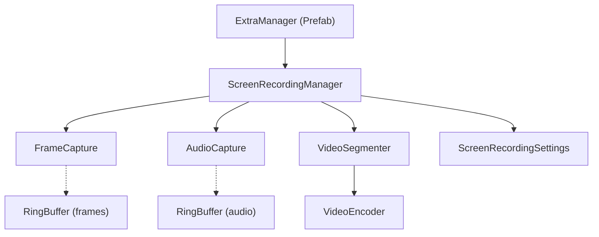
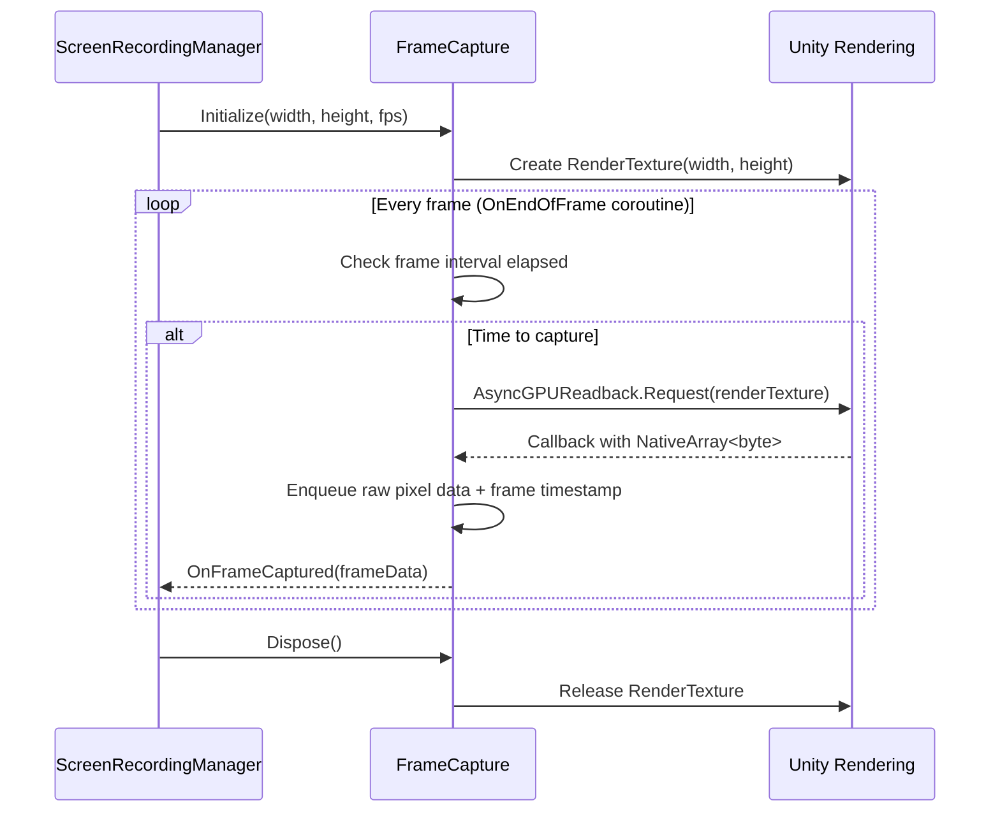
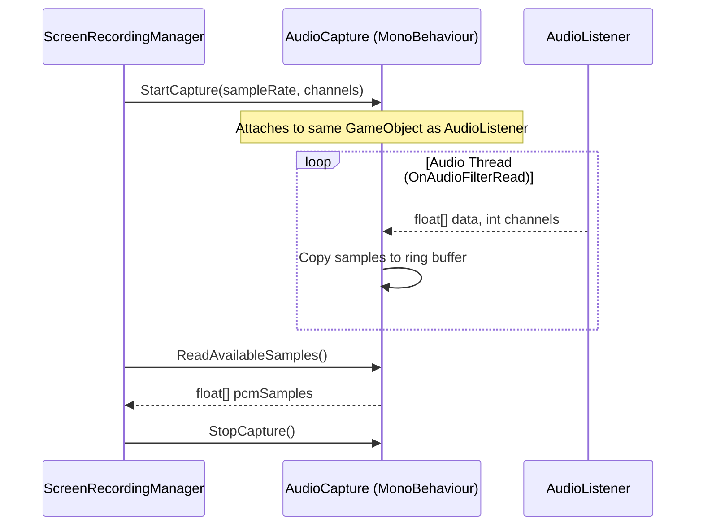
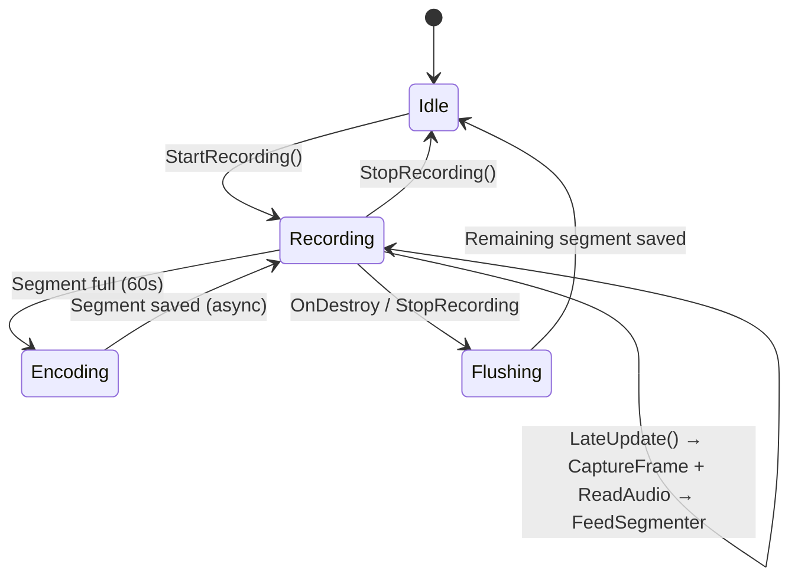
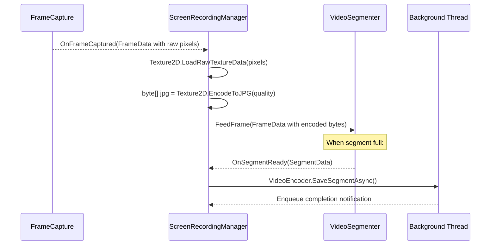

# Screen Recording Module — Implementation Plan

> **Goal**: Build a fully modular, plug-and-play Screen Recording module that lives entirely under `Assets/Extra/`. The module continuously captures gameplay video frames (including game audio) during Play Mode and persists the output as sequential 1-minute segment folders (JPG frames + WAV audio).

> [!IMPORTANT]
> **Target Platforms**: Unity Editor (Windows / macOS) **and** Android APK builds. This is a **testbed application for education purposes** — the module must be **100% native Unity** with **zero 3rd-party library dependencies** (no FFmpeg, no NatCorder, no native plugins).

---

## 1. Architecture Overview

```
Assets/Extra/
├── Plan/
│   └── Implement_Screen_Recording_Plan.md   ← (this file)
├── Prefabs/
│   └── ScreenRecording/
│       └── ExtraManager.prefab              ← Singleton prefab, drag into any scene
├── Resources/
│   └── ScreenRecording/                     ← Runtime output: saved video files
├── Scripts/
│   └── Modality_ScreenRecording/
│       ├── ScreenRecordingManager.cs        ← Main orchestrator (MonoBehaviour)
│       ├── FrameCapture.cs                  ← Grabs rendered frames via RenderTexture
│       ├── AudioCapture.cs                  ← Captures game audio via OnAudioFilterRead
│       ├── VideoSegmenter.cs                ← Splits frame+audio streams into 1-min chunks
│       ├── VideoEncoder.cs                  ← Writes frames (JPG/PNG) + audio (WAV) to disk
│       ├── ScreenRecordingSettings.cs       ← [Serializable] config class for Inspector
│       └── RingBuffer.cs                    ← Generic lock-free ring buffer utility
```

### Dependency Diagram



> [!IMPORTANT]
> The module has **zero dependencies** on the host project's scripts (no references to `KartEntity`, `GameManager`, Photon Fusion, etc.) and **zero 3rd-party library dependencies**. It uses only built-in Unity APIs (`RenderTexture`, `AsyncGPUReadback`, `Texture2D.EncodeToJPG`, `OnAudioFilterRead`). It can be copied into any Unity project as-is. It follows the same plug-and-play pattern established by the Voice Chat module (`Extra.VoiceChat` namespace).

> [!NOTE]
> **Namespace**: All scripts live under `Extra.ScreenRecording` to mirror the `Extra.VoiceChat` convention and avoid any naming collisions.

> [!NOTE]
> **Platform Compatibility**: The module runs on **Unity Editor** (Windows / macOS) and **Android APK** builds. On Android, output is written to `Application.persistentDataPath` (device internal storage). In Editor, output goes to the project's `Assets/Extra/Resources/ScreenRecording/` folder.

---

## 2. Technical Approach — Video Encoding Strategy

Unity (2022.3 LTS) does not ship a built-in video encoder API for runtime use. Since this is a **testbed application shipped as an Android APK for education purposes**, we require a **fully native solution with zero 3rd-party dependencies**.

### ✅ Chosen Strategy: **Raw Frame Sequence + WAV Audio (Option A)**

Save each segment as a folder containing:
- **JPG frames** (sequential images captured from the gameplay camera)
- **WAV audio file** (game audio captured via `OnAudioFilterRead`)
- **metadata.json** (frame rate, resolution, duration, timestamps)

**Why this approach**:
- ✅ **Zero native plugins** — uses only built-in Unity APIs (`Texture2D.EncodeToJPG`, `BinaryWriter`)
- ✅ **Fully cross-platform** — works identically on Editor (Windows/macOS) and Android APK
- ✅ **No 3rd-party libraries** — no FFmpeg, NatCorder, or external dependencies
- ✅ **Trivial to implement** — well-understood I/O patterns, easy to debug
- ✅ **Education-friendly** — data is human-readable (individual frames can be inspected)
- ⚠️ **Trade-off**: Larger disk usage (~30–50 MB/min at 720p 15fps JPG) compared to MP4, but acceptable for a testbed application

> [!TIP]
> Individual JPG frames can be viewed directly on the device or transferred via USB for analysis. For post-processing into video files, an external tool (e.g., FFmpeg on a desktop machine) can be used after data collection — but this is entirely **outside the scope** of this module.

---

## 3. Detailed Script Specifications

---

### 3.1 `ScreenRecordingSettings.cs` — Configuration

**Purpose**: Centralised, Inspector-tweakable settings for the screen recording module.

| Field | Type | Default | Description |
|:------|:-----|:--------|:------------|
| `CaptureWidth` | `int` | `1280` | Width of captured frames in pixels. |
| `CaptureHeight` | `int` | `720` | Height of captured frames in pixels. |
| `TargetFrameRate` | `int` | `15` | Frames per second to capture. Lower = smaller files, less CPU. 15 fps is sufficient for gameplay review. |
| `ImageFormat` | `enum` | `JPG` | Frame encoding format (`JPG` or `PNG`). JPG is ~5× smaller. |
| `JpgQuality` | `int` | `75` | JPEG compression quality (1–100). 75 is a good balance. |
| `SegmentDurationSeconds` | `float` | `60f` | Duration of each saved video segment. |
| `CaptureAudio` | `bool` | `true` | Whether to capture game audio alongside video frames. |
| `AudioSampleRate` | `int` | `44100` | Audio sample rate (matches Unity's default audio output). |
| `AudioChannels` | `int` | `2` | Stereo audio capture. |
| `OutputFolderPath` | `string` | `"Assets/Extra/Resources/ScreenRecording"` | Base output directory (Editor). On Android, auto-switches to `Application.persistentDataPath + "/ScreenRecording"`. |
| `FileNamePrefix` | `string` | `"screen_"` | Prefix for segment folder/file names. |
| `AutoStartOnAwake` | `bool` | `true` | Whether recording starts immediately when the manager initialises. |
| `EnableDebugLogs` | `bool` | `false` | Toggle verbose logging for development. |
| `MaxConcurrentEncoders` | `int` | `2` | Max background threads writing frame files simultaneously. |

**Enum Definition**:
```csharp
public enum ImageFormat { JPG, PNG }
```

**Implementation Tasks**:
- [ ] Create as a `[System.Serializable]` class (matching `VoiceChatSettings` pattern) for Inspector embedding in the Manager.
- [ ] Add `[Tooltip]` attributes to every field.
- [ ] Add `[Range]` attributes where appropriate (`JpgQuality`: 1–100, `TargetFrameRate`: 1–60).
- [ ] Validate settings at runtime (e.g., CaptureWidth/Height must be > 0, TargetFrameRate must be 1–60).
- [ ] Auto-detect output path at runtime: use `Application.persistentDataPath` on Android, project-relative path in Editor.

---

### 3.2 `FrameCapture.cs` — GPU Frame Grabbing

**Purpose**: Captures the rendered game view at a configurable resolution and frame rate using `RenderTexture` + `AsyncGPUReadback` (Unity 2022.3 supports this).

#### Lifecycle



#### Key Fields & Methods

| Member | Description |
|:-------|:------------|
| `RenderTexture _captureRT` | Off-screen render target matching `CaptureWidth × CaptureHeight`. |
| `Camera _targetCamera` | The camera to capture from. Defaults to `Camera.main`. |
| `float _captureInterval` | `1f / TargetFrameRate` — minimum time between captures. |
| `float _lastCaptureTime` | Timestamp of the last captured frame. |
| `bool IsCapturing { get; }` | Whether capture is actively running. |
| `void Initialize(int width, int height, int fps, Camera camera = null)` | Creates the `RenderTexture`, sets intervals, finds camera. |
| `Coroutine StartCapture()` | Starts the `WaitForEndOfFrame` coroutine loop. |
| `void StopCapture()` | Stops the coroutine, releases pending readbacks. |
| `void Dispose()` | Releases `RenderTexture` and cleans up. |
| `event Action<FrameData> OnFrameCaptured` | Callback with captured frame bytes + timestamp. |

#### `FrameData` Struct

```csharp
public struct FrameData
{
    public byte[] RawPixels;     // RGB24 or RGBA32 pixel data
    public int Width;
    public int Height;
    public float Timestamp;       // Time.realtimeSinceStartup at capture
    public int FrameIndex;        // Sequential frame number
}
```

**Implementation Tasks**:
- [ ] Use `Camera.targetTexture` temporarily during capture, then restore original.
- [ ] Use `AsyncGPUReadback.Request()` for non-blocking GPU→CPU transfer (avoids frame stalls).
- [ ] Fall back to `Texture2D.ReadPixels()` + `RenderTexture.active` if `AsyncGPUReadback` is unavailable (older platforms).
- [ ] Implement frame rate throttling: only capture when `Time.realtimeSinceStartup - _lastCaptureTime >= _captureInterval`.
- [ ] Handle camera becoming null mid-recording (scene transition). Auto-reacquire `Camera.main`.
- [ ] Use `WaitForEndOfFrame` in a coroutine to ensure the frame is fully rendered before capture.
- [ ] Make this a plain C# class (IDisposable) that receives a MonoBehaviour reference for coroutine hosting.
- [ ] Convert pixel data from bottom-up (GPU convention) to top-down (image convention) if needed.

---

### 3.3 `AudioCapture.cs` — Game Audio Recording

**Purpose**: Captures the game's audio output via Unity's `OnAudioFilterRead` callback, accumulating PCM samples in a thread-safe ring buffer.

#### Lifecycle



#### Key Fields & Methods

| Member | Description |
|:-------|:------------|
| `float[] _ringBuffer` | Circular buffer sized for ~5 seconds of audio. |
| `int _writePos` | Current write position (modified on audio thread). |
| `int _readPos` | Current read position (modified on main thread). |
| `bool IsCapturing { get; }` | Whether audio capture is active. |
| `void StartCapture(int sampleRate, int channels)` | Allocates ring buffer, sets capturing flag. |
| `void OnAudioFilterRead(float[] data, int channels)` | Unity audio callback (runs on audio thread). Copies PCM data into ring buffer. Must NOT allocate. |
| `float[] ReadAvailableSamples()` | Main-thread method. Reads all available samples from ring buffer since last read. |
| `void StopCapture()` | Stops capturing, clears buffer. |

**Implementation Tasks**:
- [ ] This **must** be a `MonoBehaviour` because `OnAudioFilterRead` is a Unity message that requires it.
- [ ] Attach `AudioCapture` to the **same GameObject** that has the `AudioListener`, or to the `ScreenRecordingManager` GameObject (which should have an `AudioListener` added at runtime if none exists in the scene).
- [ ] Use `volatile` or `Interlocked` operations for `_writePos` / `_readPos` since `OnAudioFilterRead` runs on the audio thread.
- [ ] Do **zero allocations** inside `OnAudioFilterRead` — pre-allocate the ring buffer.
- [ ] Handle ring buffer wrap-around correctly.
- [ ] `OnAudioFilterRead` must pass audio through unmodified (do not zero it out, or the game audio will go silent). Copy the data, then return.
- [ ] Ring buffer size: `sampleRate * channels * 5` (5 seconds of headroom).
- [ ] If the ring buffer overflows (write catches up to read), log a warning and overwrite oldest data.

> [!WARNING]
> `OnAudioFilterRead` runs on the **audio thread**, not the main thread. All data exchange with the main thread must be lock-free or use minimal locking to avoid audio glitches.

---

### 3.4 `VideoSegmenter.cs` — Chunking Frames + Audio into 1-Minute Segments

**Purpose**: Accumulates captured frames and audio samples, and when a segment duration (60s) has elapsed, triggers the encoding/save pipeline for that segment.

#### Key Fields & Methods

| Member | Description |
|:-------|:------------|
| `List<FrameData> _frameBuffer` | Accumulated frames for the current segment. |
| `List<float> _audioBuffer` | Accumulated audio samples for the current segment. |
| `float _segmentStartTime` | `Time.realtimeSinceStartup` when the current segment started. |
| `int _segmentIndex` | Auto-incrementing counter for naming. |
| `float _segmentDuration` | Target duration in seconds (default 60). |
| `event Action<SegmentData> OnSegmentReady` | Callback fired when a segment is complete. |
| `void FeedFrame(FrameData frame)` | Adds a frame to the current segment. Checks if segment duration exceeded. |
| `void FeedAudio(float[] samples, int count)` | Appends audio samples to the current segment. |
| `void FlushRemaining()` | Forces a write of the current partial segment (on stop/destroy). |
| `void Reset()` | Clears all buffers and resets counters. |

#### `SegmentData` Struct

```csharp
public class SegmentData
{
    public FrameData[] Frames;
    public float[] AudioSamples;
    public int AudioSampleCount;
    public int SegmentIndex;
    public float Duration;          // Actual duration of this segment
    public int FrameRate;
    public int AudioSampleRate;
    public int AudioChannels;
    public int Width;
    public int Height;
}
```

**Implementation Tasks**:
- [ ] Determine segment completion by checking `Time.realtimeSinceStartup - _segmentStartTime >= _segmentDuration` whenever a new frame arrives.
- [ ] When a segment is ready, deep-copy frame and audio data into a `SegmentData` object so the buffers can be reused immediately.
- [ ] Pre-size `_frameBuffer` to `TargetFrameRate * SegmentDurationSeconds` to avoid resizing.
- [ ] Pre-size `_audioBuffer` to `AudioSampleRate * AudioChannels * SegmentDurationSeconds`.
- [ ] On `FlushRemaining()`, emit whatever partial data exists (even if < 60s).
- [ ] Make this a plain C# class (not MonoBehaviour).

---

### 3.5 `VideoEncoder.cs` — Frame+Audio → Files on Disk

**Purpose**: Takes a `SegmentData` object and writes it to disk as a folder of JPG frames + WAV audio + metadata.json. Fully native — no 3rd-party dependencies.

#### Output Structure per Segment

```
<OutputFolder>/
└── screen_20260718_195732_001/
    ├── frame_0000.jpg
    ├── frame_0001.jpg
    ├── ...
    ├── frame_0899.jpg     (15fps × 60s = 900 frames)
    ├── audio.wav
    └── metadata.json      (fps, resolution, duration, frame count)
```

#### Key Methods

| Method | Description |
|:-------|:------------|
| `static Task SaveSegmentAsync(SegmentData data, string outputFolder, string segmentName, ScreenRecordingSettings settings)` | Main entry point. Creates segment folder, writes frames + audio + metadata. |
| `static Task SaveFramesAsync(SegmentData data, string segmentFolder, ScreenRecordingSettings settings)` | Writes pre-encoded JPG/PNG byte arrays to individual frame files in parallel. |
| `static void WriteWavAudio(string filePath, float[] samples, int sampleCount, int sampleRate, int channels)` | Encodes PCM float[] → 16-bit signed WAV file. Self-contained (no dependency on VoiceChat module). |
| `static void WriteMetadataJson(string filePath, SegmentData data, ScreenRecordingSettings settings)` | Writes the segment's metadata to a JSON file. |

**`metadata.json` Schema**:
```json
{
    "frameRate": 15,
    "width": 1280,
    "height": 720,
    "frameCount": 900,
    "durationSeconds": 60.0,
    "audioSampleRate": 44100,
    "audioChannels": 2,
    "imageFormat": "JPG",
    "platform": "Android",
    "createdAt": "2026-07-18T19:57:32+07:00"
}
```

**Implementation Tasks**:
- [ ] **Frame encoding**: `Texture2D.EncodeToJPG()` / `EncodeToJPG()` must be called on the main thread. Encode frames to byte arrays on the main thread as they arrive, then write bytes to disk on a background thread.
- [ ] Create `Texture2D` once and reuse it (resize via `Texture2D.Reinitialize()` or `LoadRawTextureData()` to avoid per-frame allocation).
- [ ] Write frame files in parallel batches on background thread using `Task.WhenAll`.
- [ ] WAV writing: implement inline (copy logic from `WavFileWriter.cs` in VoiceChat module but keep it self-contained under this namespace).
- [ ] `metadata.json`: Use `JsonUtility` or manual string building (avoid external JSON libraries for portability). Include `Application.platform` in the metadata.
- [ ] Create output directories recursively with `Directory.CreateDirectory()`.
- [ ] On Android, verify write permissions and log clear errors if storage is not accessible.

> [!NOTE]
> `ImageConversion.EncodeToJPG()` operates on `Texture2D` which must be accessed from the main thread. The strategy is: **encode on main thread → enqueue byte[] → write to disk on background thread**.

---

### 3.6 `RingBuffer.cs` — Thread-Safe Circular Buffer

**Purpose**: Generic lock-free ring buffer for passing data between the audio thread and main thread.

| Member | Description |
|:-------|:------------|
| `T[] _buffer` | Backing array. |
| `volatile int _writePos` | Write cursor (audio thread). |
| `volatile int _readPos` | Read cursor (main thread). |
| `int Capacity` | Total buffer size. |
| `int AvailableRead` | Number of elements available for reading. |
| `void Write(T[] data, int offset, int count)` | Writes data into the ring, handles wrap-around. |
| `int Read(T[] destination, int offset, int maxCount)` | Reads available data into destination. Returns actual count read. |
| `void Clear()` | Resets both cursors to 0. |

**Implementation Tasks**:
- [ ] Use `System.Threading.Volatile.Read/Write` or `volatile` keyword for cursor fields.
- [ ] No locks — single-producer single-consumer (SPSC) pattern.
- [ ] Handle wrap-around with modulo arithmetic.
- [ ] Generic `RingBuffer<T>` so it can be reused for `float` (audio) or `byte[]` (frames).

---

### 3.7 `ScreenRecordingManager.cs` — Main Orchestrator (MonoBehaviour)

**Purpose**: The single MonoBehaviour that lives on the `ExtraManager` prefab. Owns and coordinates all sub-systems for screen recording.

#### Inspector-Exposed Config

```csharp
[Header("Screen Recording Settings")]
[SerializeField] private ScreenRecordingSettings settings = new ScreenRecordingSettings();
```

#### Lifecycle & Flow



#### Key Methods

| Method | Description |
|:-------|:------------|
| `Awake()` | Singleton enforcement (`DontDestroyOnLoad`). If `autoStartOnAwake`, calls `StartRecording()`. |
| `StartRecording()` | Creates `FrameCapture`, `AudioCapture`, `VideoSegmenter` instances. Subscribes to callbacks. Starts captures. |
| `LateUpdate()` | Reads captured frames from `FrameCapture`, audio from `AudioCapture`, feeds both to `VideoSegmenter`. Encodes pending frames to JPG/PNG on main thread. |
| `StopRecording()` | Flushes the segmenter, stops captures, cleans up. |
| `OnDestroy()` | Calls `StopRecording()` to ensure no data is lost. Waits for pending save tasks. |
| `OnSegmentReady(SegmentData data)` | Generates a timestamped folder/file name, dispatches `VideoEncoder.SaveSegmentAsync()` on a background thread. |
| `string GenerateSegmentName(int segmentIndex)` | Returns e.g. `screen_20260718_195732_001`. Uses `DateTime.Now`. |
| `OnApplicationPause(bool paused)` | Pause: flush + stop captures. Resume: restart captures. |
| `OnApplicationQuit()` | Flush and save remaining data. |

#### Frame Encoding Pipeline (Main Thread)

Since `Texture2D.EncodeToJPG()` must run on the main thread, the manager handles a frame encoding queue:



**Implementation Tasks**:
- [ ] Implement singleton pattern (self-contained, no project dependencies) — same pattern as `VoiceChatManager`.
- [ ] In `Awake()`, find or create `Camera.main` reference. Log error if no camera found.
- [ ] Handle `AudioCapture` component lifecycle — add it at runtime to the AudioListener's GameObject, or to `this.gameObject` if the manager itself gets an AudioListener.
- [ ] Create a reusable `Texture2D` for frame encoding to avoid per-frame allocation.
- [ ] Throttle frame encoding: skip encoding if we've already encoded enough frames for this Update tick.
- [ ] In `LateUpdate()`, guard against null capture / not recording state.
- [ ] Generate segment names with format: `{prefix}{yyyyMMdd}_{HHmmss}_{segmentIndex:D3}`.
- [ ] After saving in Editor mode, call `#if UNITY_EDITOR AssetDatabase.Refresh() #endif` so files appear in the Project window.
- [ ] Provide public `StartRecording()` / `StopRecording()` so external scripts can control recording.
- [ ] Add a public read-only property `bool IsRecording`.
- [ ] Add a public event `System.Action<string> OnSegmentSaved` for external consumers.
- [ ] Handle `OnApplicationPause(bool)` — flush and suspend on pause, restart on resume.
- [ ] Handle `OnApplicationQuit()` — flush and save.
- [ ] Wait for pending save tasks in `OnDestroy()` (timeout 5 seconds).
- [ ] Cap encoding to `MaxConcurrentEncoders` background tasks to avoid memory exhaustion.

---

## 4. Prefab Setup — `ExtraManager.prefab`

- [ ] Create an empty GameObject named `ExtraManager`.
- [ ] Attach the `ScreenRecordingManager` component.
- [ ] Attach the `AudioCapture` component (for `OnAudioFilterRead`).
- [ ] Configure default Inspector values (1280×720, 15 fps, JPG quality 75, segment 60s, auto-start on).
- [ ] Save as prefab at `Assets/Extra/Prefabs/ScreenRecording/ExtraManager.prefab`.
- [ ] The prefab should use `DontDestroyOnLoad` so it persists across scene loads.

**Usage**: Drag `ExtraManager.prefab` into **any** scene in any project. That's it — recording starts automatically on Play.

> [!NOTE]
> This is a **separate** `ExtraManager` prefab from the VoiceChat one. In a production setup, both `ScreenRecordingManager` and `VoiceChatManager` could coexist on the **same** ExtraManager GameObject, but for modularity each module ships its own prefab.

---

## 5. File Naming & Output Convention

### Segment Folder Name

| Component | Format | Example |
|:----------|:-------|:--------|
| Prefix | Configurable | `screen_` |
| Date | `yyyyMMdd` | `20260718` |
| Time | `HHmmss` | `195732` |
| Segment index | `D3` (zero-padded 3 digits) | `001` |
| **Full folder name** | | `screen_20260718_195732_001` |

### Output Structure

**In Editor** (Windows / macOS):
```
Assets/Extra/Resources/ScreenRecording/
├── screen_20260718_195732_001/
│   ├── frame_0000.jpg
│   ├── frame_0001.jpg
│   ├── ...
│   ├── frame_0899.jpg
│   ├── audio.wav
│   └── metadata.json
├── screen_20260718_195832_002/
│   ├── ...
```

**On Android APK**:
```
<Application.persistentDataPath>/ScreenRecording/
├── screen_20260718_195732_001/
│   ├── frame_0000.jpg
│   ├── ...
│   ├── audio.wav
│   └── metadata.json
├── screen_20260718_195832_002/
│   ├── ...
```

> [!NOTE]
> On Android, `Application.persistentDataPath` maps to the app's internal storage (e.g., `/storage/emulated/0/Android/data/<package>/files/`). Files can be retrieved via USB, Android File Transfer, or `adb pull`. In Editor, saving to `Resources/` allows quick inspection in the Project window.

---

## 6. Edge Cases & Robustness

- [ ] **No camera found**: Log a clear error on `Awake()`. Set `IsRecording = false`. Do not throw.
- [ ] **Camera changes (scene transitions)**: Re-acquire `Camera.main` each frame in `LateUpdate()`. If null, skip frame capture but keep audio capture running.
- [ ] **AudioListener not found**: Log warning. Attach `AudioListener` to the manager's GameObject as a fallback, or run in video-only mode.
- [ ] **GPU readback failure**: `AsyncGPUReadback` can fail on some Android devices. Catch errors in the readback callback, log them, and fall back to `Texture2D.ReadPixels()`. Skip the frame if both fail.
- [ ] **Frame rate drops**: If the game runs below `TargetFrameRate`, capture every frame. The segmenter should use wall-clock time, not frame count, to determine segment boundaries.
- [ ] **Disk space (Android)**: Log cumulative bytes written. Optionally add a `MaxTotalSizeMB` setting that stops recording when exceeded. Android devices may have limited storage.
- [ ] **Application pause/resume (critical on Android)**: On Android, `OnApplicationPause(true)` fires when the app goes to background. Flush current segment immediately and stop captures. Restart on resume.
- [ ] **Ring-buffer overrun (audio)**: If the main thread doesn't read audio fast enough, overwrite oldest data and log a warning.
- [ ] **Scene transitions**: `DontDestroyOnLoad` ensures continuous recording. Camera re-acquisition handles the new scene's camera.
- [ ] **Thread safety**: Frame encoding happens on the main thread. Only file I/O (writing bytes to disk) runs on background threads with no shared mutable state.
- [ ] **Disk write failure**: Catch `IOException` in `VideoEncoder`, log the error, continue recording the next segment. Do not crash.
- [ ] **Memory pressure**: Monitor total buffered frame data. If pending segments exceed a threshold (e.g., 500 MB), drop the oldest unwritten segment and log a warning.
- [ ] **Android permissions**: No special permissions needed for `Application.persistentDataPath` (app-scoped internal storage). Verify this at startup and log status.
- [ ] **Android thermal throttling**: If the device heats up and reduces GPU clock, `AsyncGPUReadback` may stall. Implement a timeout on readback requests (skip frame after 100ms).

---

## 7. Implementation Checklist (TODO)

### Phase 1: Foundation & Settings
- [x] Create folder structure: `Scripts/Modality_ScreenRecording/`, `Prefabs/ScreenRecording/`, `Resources/ScreenRecording/`
- [x] Implement `ScreenRecordingSettings.cs` — `[Serializable]` config class with `[Tooltip]` and `[Range]` attributes
- [x] Implement `RingBuffer.cs` — generic SPSC lock-free ring buffer
- [x] Write a quick Editor test: create `RingBuffer<float>`, write/read/wrap-around, verify correctness

### Phase 2: Frame Capture
- [x] Implement `FrameCapture.cs` — `RenderTexture` + `AsyncGPUReadback` + WaitForEndOfFrame coroutine
- [x] Handle frame rate throttling (only capture at configured fps)
- [x] Handle `Camera.main` re-acquisition on scene transitions
- [x] Handle GPU readback fallback (`Texture2D.ReadPixels`) for unsupported platforms
- [x] Test standalone: attach a temp MonoBehaviour, capture 10 frames, verify pixel data is valid

### Phase 3: Audio Capture
- [x] Implement `AudioCapture.cs` — `OnAudioFilterRead` + ring buffer
- [x] Verify audio pass-through (game audio is NOT muted during capture)
- [x] Verify thread safety with `volatile` cursors
- [x] Test standalone: capture 5 seconds of audio, save as WAV, verify it plays correctly

### Phase 4: Video Segmenter
- [x] Implement `VideoSegmenter.cs` — time-based segmentation of frames + audio
- [x] Handle segment completion by wall-clock time
- [x] Deep-copy segment data for background thread safety
- [x] Test: feed frames for 2+ minutes, verify 2 segment callbacks fire at ~60s intervals
- [x] Test: flush partial segment, verify callback fires with correct partial data

### Phase 5: Video Encoder
- [x] Implement `VideoEncoder.SaveSegmentAsync()` — write JPG frames + WAV audio + metadata.json
- [x] Implement `VideoEncoder.SaveFramesAsync()` — parallel file writes with `Task.WhenAll`
- [x] Implement inline WAV writing (standalone, no dependency on VoiceChat module)
- [x] Implement `VideoEncoder.WriteMetadataJson()` — segment metadata with platform info
- [x] Test: verify folder structure, frame files, audio.wav, and metadata.json are correct
- [x] Test on Android: verify `Application.persistentDataPath` output is accessible and correct

### Phase 6: Manager Integration
- [x] Implement `ScreenRecordingManager.cs` — wire all components together
- [x] Implement singleton pattern (self-contained, no project dependencies)
- [x] Implement main-thread frame encoding pipeline (`Texture2D.LoadRawTextureData` → `EncodeToJPG`)
- [x] Wire `OnSegmentReady` → `VideoEncoder.SaveSegmentAsync()` on background thread
- [x] Add `#if UNITY_EDITOR AssetDatabase.Refresh() #endif` after save
- [x] Implement `OnApplicationPause` / `OnApplicationQuit` handlers
- [x] Cap concurrent background encoding tasks to `MaxConcurrentEncoders`
- [x] Add `[Header]` and `[Tooltip]` attributes to all serialized fields

### Phase 7: Prefab & Polish
- [x] Create `ExtraManager` prefab with `ScreenRecordingManager` + `AudioCapture` attached
- [x] Set default Inspector values (1280×720, 15fps, JPG 75, segment 60s, auto-start)
- [x] Test: drop prefab into a blank scene, press Play for 2+ minutes, verify segment folders appear
- [x] Test: verify recordings survive scene transitions
- [x] Test: verify partial segment is saved on Play Mode stop
- [x] Test: verify game audio continues playing normally (no muting)
- [x] Profile: ensure frame capture overhead stays under 5ms per frame at 720p

### Phase 8: Portability & Android Verification
- [x] Copy `Assets/Extra/` folder into a fresh empty Unity project
- [x] Verify it compiles with zero errors and zero warnings
- [x] Verify recording works out of the box in Editor (Windows / macOS)
- [x] Verify namespace isolation (`Extra.ScreenRecording`) — no collisions
- [x] Build Android APK, deploy to device, verify recording works
- [x] Verify output files are accessible via USB / `adb pull` on Android
- [x] Verify no 3rd-party dependencies (grep for external `using` statements)

---

## 8. API Reference (Public Surface)

```csharp
namespace Extra.ScreenRecording
{
    // --- ScreenRecordingManager ---
    public class ScreenRecordingManager : MonoBehaviour
    {
        public static ScreenRecordingManager Instance { get; }

        public bool IsRecording { get; }

        /// <summary>
        /// Fired on the main thread when a segment has been saved to disk.
        /// Returns the absolute path to the saved segment folder.
        /// </summary>
        public event System.Action<string> OnSegmentSaved;

        public void StartRecording();
        public void StopRecording();
    }
}
```

> [!TIP]
> External scripts only ever need to interact with `ScreenRecordingManager.Instance`. All internal classes (`FrameCapture`, `AudioCapture`, `VideoSegmenter`, `VideoEncoder`, `RingBuffer`) are `internal` — they are implementation details.

---

## 9. Performance & File Size Estimates

### Frame File Sizes (per frame)

| Resolution | Format | Quality | Approx. Size |
|:-----------|:-------|:--------|:-------------|
| 1280×720   | JPG    | 75      | ~30–80 KB    |
| 1280×720   | PNG    | N/A     | ~500–1000 KB |
| 1920×1080  | JPG    | 75      | ~60–150 KB   |

### Segment Sizes (60 seconds)

| Resolution | FPS | Format | Video Size | Audio Size | Total |
|:-----------|:----|:-------|:-----------|:-----------|:------|
| 1280×720   | 15  | JPG 75 | ~30–70 MB  | ~10 MB     | ~40–80 MB |
| 1920×1080  | 15  | JPG 75 | ~55–130 MB | ~10 MB     | ~65–140 MB |

> [!NOTE]
> **Android storage consideration**: At ~40–80 MB per minute (720p), a 10-minute recording session uses ~400–800 MB. Ensure target devices have sufficient free storage. Consider lowering resolution or JPG quality for longer sessions.

### CPU Overhead Estimate

| Operation | Per-Frame Cost | Notes |
|:----------|:---------------|:------|
| `AsyncGPUReadback` | < 1ms | Non-blocking GPU transfer |
| `EncodeToJPG` (720p) | ~2–4ms | Main thread, unavoidable |
| Audio copy (OnAudioFilterRead) | < 0.1ms | Lock-free ring buffer |
| Background disk I/O | 0ms (main thread) | All writes on Task threads |

> [!WARNING]
> `EncodeToJPG` on the main thread is the bottleneck. At 15 fps, this adds ~2–4ms of main-thread work per frame. If this is too much, consider reducing `TargetFrameRate` to 10 fps or lowering resolution.

---

## 10. Future Extensions (Out of Scope for v1)

- [ ] Post-collection FFmpeg mux (desktop-side script to convert frame folders → MP4)
- [ ] GPU-accelerated encoding via compute shaders (custom JPG on GPU)
- [ ] Circular buffer mode: keep only the last N minutes, overwrite oldest segments
- [ ] In-game playback UI for reviewing recordings (load JPG sequence as flipbook)
- [ ] Real-time streaming (e.g., RTMP to a server)
- [ ] Overlay rendering: timestamp / player name / debug info burned into frames
- [ ] Cloud upload of segments (WiFi auto-upload from Android device)
- [ ] Adaptive quality: lower resolution/fps automatically when the game drops below target frame rate
- [ ] Android: detect available storage and auto-adjust quality/duration limits
- [ ] ADB integration: companion desktop script to auto-pull recordings from connected device
