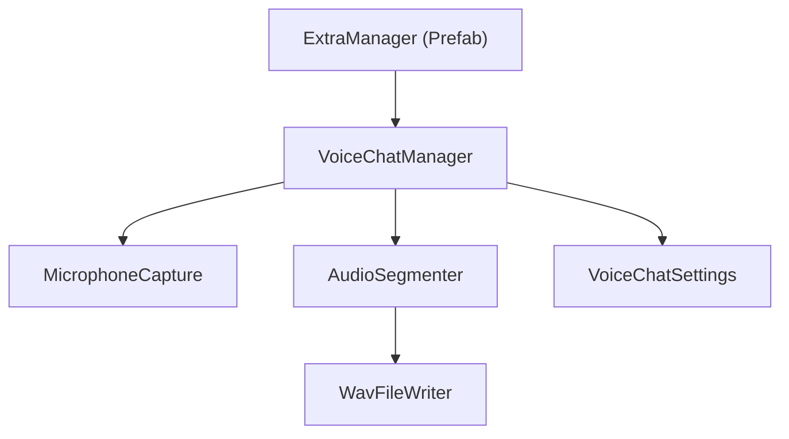
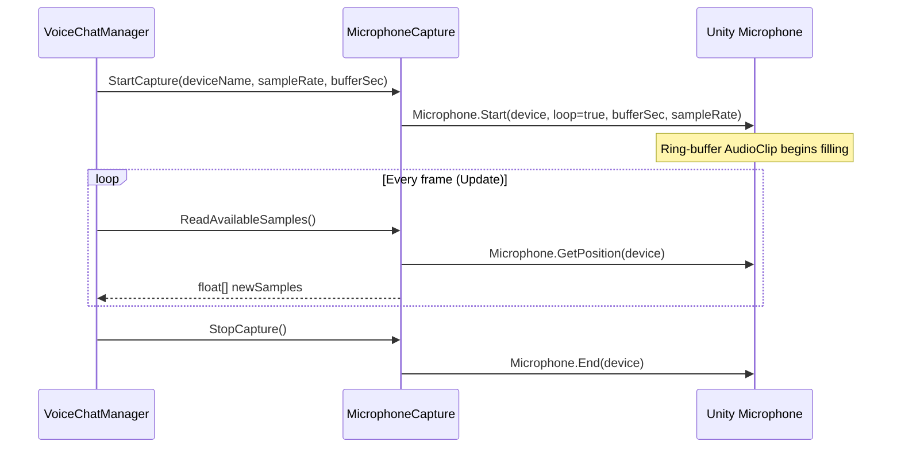
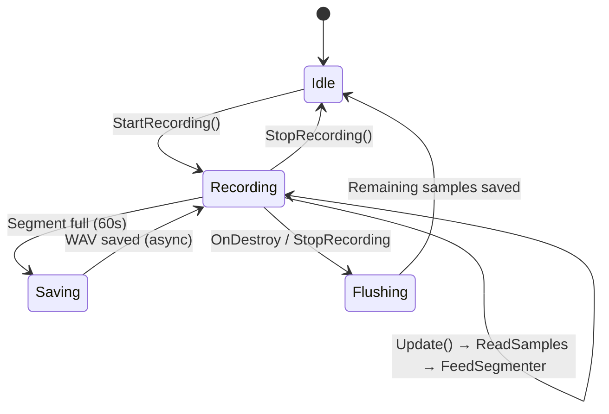

# Voice Chat Module — Implementation Plan

> **Goal**: Build a fully modular, plug-and-play Voice Chat module that lives entirely under `Assets/Extra/`. The module continuously captures microphone audio during gameplay and persists it as sequential 1-minute `.wav` files.

---

## 1. Architecture Overview

```
Assets/Extra/
├── Plan/
│   └── Implement_Voice_Chat_Plan.md   ← (this file)
├── Prefabs/
│   └── VoiceChat/
│       └── ExtraManager.prefab        ← Singleton prefab, drag into any scene
├── Resources/
│   └── VoiceChat/                     ← Runtime output: saved .wav files
├── Scripts/
│   └── VoiceChat/
│       ├── VoiceChatManager.cs        ← Main orchestrator (MonoBehaviour)
│       ├── MicrophoneCapture.cs       ← Continuous mic recording & ring-buffer
│       ├── AudioSegmenter.cs          ← Splits audio stream into 1-min chunks
│       ├── WavFileWriter.cs           ← Encodes PCM float[] → WAV on disk
│       └── VoiceChatSettings.cs       ← ScriptableObject / static config
```

### Dependency Diagram



> [!IMPORTANT]
> The module has **zero dependencies** on the host project's scripts (no references to `KartEntity`, `GameManager`, Photon Fusion, etc.). It can be copied into any Unity project as-is.

---

## 2. Detailed Script Specifications

---

### 2.1 `VoiceChatSettings.cs` — Configuration

**Purpose**: Centralised, easily-tweakable settings for the voice module.

| Field | Type | Default | Description |
|:------|:-----|:--------|:------------|
| `SampleRate` | `int` | `16000` | Recording sample rate in Hz. 16 kHz is speech-quality and keeps file sizes small (~1.9 MB/min mono). |
| `SegmentDurationSeconds` | `float` | `60f` | Duration of each saved WAV segment. |
| `ChannelCount` | `int` | `1` | Mono recording (1 channel). Stereo is unnecessary for voice. |
| `OutputFolderPath` | `string` | `"Assets/Extra/Resources/VoiceChat"` | Relative project path where WAV files are saved. |
| `FileNamePrefix` | `string` | `"voice_"` | Prefix for saved files, e.g. `voice_20260718_185732_001.wav`. |
| `MicrophoneDeviceName` | `string` | `""` (empty = default device) | Allows overriding the microphone device. |
| `AutoStartOnAwake` | `bool` | `true` | Whether recording starts immediately when the manager initialises. |
| `MaxMicBufferLengthSeconds` | `int` | `120` | Length of the internal Unity `Microphone.Start()` clip ring buffer. Must be > `SegmentDurationSeconds`. |
| `EnableDebugLogs` | `bool` | `false` | Toggle verbose logging for development. |

**Implementation Details**:
- [ ] Create as a plain `static class` with `const` / `static readonly` fields for simplicity (no ScriptableObject asset management needed for portability).
- [ ] Alternatively, support runtime override via a `[System.Serializable]` config class embedded in `VoiceChatManager` so values can be tuned in the Inspector on the prefab.

---

### 2.2 `MicrophoneCapture.cs` — Continuous Microphone Recording

**Purpose**: Wraps Unity's `Microphone` API to provide continuous, non-stop audio capture via a ring buffer.

#### Lifecycle



#### Key Fields & Methods

| Member | Description |
|:-------|:------------|
| `AudioClip _micClip` | The looping AudioClip created by `Microphone.Start()`. |
| `int _lastReadPosition` | Tracks where we last read from the ring buffer to avoid re-reading or missing samples. |
| `bool IsCapturing { get; }` | Read-only property indicating active recording. |
| `void StartCapture(string device, int sampleRate, int bufferLengthSec)` | Validates device exists, calls `Microphone.Start()` with `loop = true`. |
| `float[] ReadAvailableSamples()` | Compares `Microphone.GetPosition()` with `_lastReadPosition`, handles wrap-around, copies new samples via `AudioClip.GetData()`, advances `_lastReadPosition`. Returns empty array if no new data. |
| `void StopCapture()` | Calls `Microphone.End()`, resets state. |
| `string[] GetAvailableDevices()` | Wrapper around `Microphone.devices`. |

**Implementation Tasks**:
- [ ] Handle ring-buffer wrap-around correctly when `Microphone.GetPosition()` resets to 0.
- [ ] Return an empty/null array when no new samples are available (position unchanged).
- [ ] Guard against `Microphone.GetPosition()` returning -1 (device not ready).
- [ ] Log a warning if the read position falls behind by more than half the buffer (data loss risk).
- [ ] Make the class **not** a MonoBehaviour — it's a plain C# class owned by `VoiceChatManager`.

---

### 2.3 `AudioSegmenter.cs` — Chunking Audio into 1-Minute Segments

**Purpose**: Accumulates raw PCM samples from `MicrophoneCapture` and, once a full segment (60 s) has been collected, triggers a file write.

#### Key Fields & Methods

| Member | Description |
|:-------|:------------|
| `float[] _segmentBuffer` | Pre-allocated buffer sized to `sampleRate × segmentDuration × channels`. |
| `int _segmentWritePos` | Current write cursor into `_segmentBuffer`. |
| `int _segmentIndex` | Auto-incrementing counter for file naming. |
| `System.Action<float[], int, int> OnSegmentReady` | Callback fired when a segment is full. Args: `(buffer, sampleCount, segmentIndex)`. |
| `void FeedSamples(float[] samples, int count)` | Appends samples to `_segmentBuffer`. If the buffer fills up, it fires `OnSegmentReady`, resets the write position, and copies overflow samples into the new segment. |
| `void FlushRemaining()` | Forces a write of whatever partial segment remains (called on stop/destroy). |
| `void Reset()` | Clears the buffer and resets counters. |

**Implementation Tasks**:
- [ ] Pre-allocate `_segmentBuffer` in constructor/Init to avoid runtime allocations.
- [ ] Handle the case where incoming samples span a segment boundary (split and carry over).
- [ ] On `FlushRemaining()`, pad the final buffer or write only the valid sample count (prefer the latter to avoid silence padding).
- [ ] Make this a plain C# class (not MonoBehaviour).

---

### 2.4 `WavFileWriter.cs` — WAV Encoding & Disk I/O

**Purpose**: Static utility that converts a `float[]` PCM buffer into a valid `.wav` file and writes it to disk.

#### WAV File Format (RIFF)

```
Offset  Size  Description
──────  ────  ──────────────────────────
0       4     "RIFF"
4       4     File size - 8
8       4     "WAVE"
12      4     "fmt "
16      4     Sub-chunk size (16 for PCM)
20      2     Audio format (1 = PCM)
22      2     Number of channels
24      4     Sample rate
28      4     Byte rate (sampleRate × channels × bitsPerSample/8)
32      2     Block align (channels × bitsPerSample/8)
34      2     Bits per sample (16)
36      4     "data"
40      4     Data chunk size
44      ...   Raw PCM data (16-bit signed integers)
```

#### Key Methods

| Method | Description |
|:-------|:------------|
| `static void Save(string filePath, float[] samples, int sampleCount, int sampleRate, int channels)` | Writes a complete WAV file. Converts `float[-1..1]` → `Int16` PCM. Uses `System.IO.BinaryWriter`. |
| `static byte[] EncodeToWav(float[] samples, int sampleCount, int sampleRate, int channels)` | Returns the WAV as a byte array (useful for streaming/upload later). |

**Implementation Tasks**:
- [ ] Convert float samples to 16-bit signed PCM: `(short)(sample * 32767f)`, clamped to `[-32768, 32767]`.
- [ ] Write the 44-byte RIFF/WAV header correctly.
- [ ] Use `System.IO.Directory.CreateDirectory()` to ensure the output folder exists before writing.
- [ ] Run disk I/O on a background thread (`System.Threading.Tasks.Task.Run`) to avoid frame hitches.
- [ ] Return the final file path for logging / confirmation.

---

### 2.5 `VoiceChatManager.cs` — Main Orchestrator (MonoBehaviour)

**Purpose**: The single MonoBehaviour that lives on the `ExtraManager` prefab. Owns and coordinates all sub-systems.

#### Inspector-Exposed Config

```csharp
[Header("Voice Chat Settings")]
[SerializeField] private int sampleRate = 16000;
[SerializeField] private float segmentDurationSeconds = 60f;
[SerializeField] private int channels = 1;
[SerializeField] private string outputFolder = "Assets/Extra/Resources/VoiceChat";
[SerializeField] private string fileNamePrefix = "voice_";
[SerializeField] private bool autoStartOnAwake = true;
[SerializeField] private int micBufferLengthSeconds = 120;
[SerializeField] private bool enableDebugLogs = false;
```

#### Lifecycle & Flow



#### Key Methods

| Method | Description |
|:-------|:------------|
| `Awake()` | Singleton enforcement (`DontDestroyOnLoad`). If `autoStartOnAwake`, calls `StartRecording()`. |
| `StartRecording()` | Creates `MicrophoneCapture` + `AudioSegmenter` instances. Subscribes to `OnSegmentReady`. Starts mic capture. |
| `Update()` | Reads new samples from `MicrophoneCapture.ReadAvailableSamples()` and feeds them to `AudioSegmenter.FeedSamples()`. |
| `StopRecording()` | Flushes the segmenter, stops the mic capture. |
| `OnDestroy()` | Calls `StopRecording()` to ensure no data is lost. |
| `OnSegmentReady(float[] buffer, int count, int index)` | Generates a timestamped filename, dispatches `WavFileWriter.Save()` on a background thread. |
| `string GenerateFileName(int segmentIndex)` | Returns e.g. `voice_20260718_185732_001.wav`. Uses `DateTime.Now`. |

**Implementation Tasks**:
- [ ] Implement singleton pattern using `DontDestroyOnLoad` (similar to project's `AudioManager` via `Singleton<T>`). However, since this module must be project-independent, implement a self-contained singleton without relying on the project's `Singleton<T>` utility.
- [ ] In `Awake()`, check `Microphone.devices.Length > 0`; log error and disable if no mic.
- [ ] In `Update()`, guard against null capture / not recording state.
- [ ] Generate file names with format: `{prefix}{yyyyMMdd}_{HHmmss}_{segmentIndex:D3}.wav`.
- [ ] After saving in Editor mode, call `#if UNITY_EDITOR AssetDatabase.Refresh() #endif` so the file appears in the Project window.
- [ ] Provide public `StartRecording()` / `StopRecording()` so external scripts can control recording if needed.
- [ ] Add a public read-only property `bool IsRecording`.
- [ ] Add a public event `System.Action<string> OnSegmentSaved` so external consumers can react to new files.
- [ ] Handle `OnApplicationPause(bool paused)` — on mobile, the mic may need to be restarted after un-pause.
- [ ] Handle `OnApplicationQuit()` — flush and save remaining audio.

---

## 3. Prefab Setup — `ExtraManager.prefab`

- [ ] Create an empty GameObject named `ExtraManager`.
- [ ] Attach the `VoiceChatManager` component.
- [ ] Configure default Inspector values (sample rate 16000, segment 60s, mono, auto-start on).
- [ ] Save as prefab at `Assets/Extra/Prefabs/VoiceChat/ExtraManager.prefab`.
- [ ] The prefab should use `DontDestroyOnLoad` so it persists across scene loads.

**Usage**: Drag `ExtraManager.prefab` into **any** scene in any project. That's it — recording starts automatically.

---

## 4. File Naming & Output Convention

| Component | Format | Example |
|:----------|:-------|:--------|
| Prefix | Configurable | `voice_` |
| Date | `yyyyMMdd` | `20260718` |
| Time | `HHmmss` | `185732` |
| Segment index | `D3` (zero-padded 3 digits) | `001` |
| Extension | `.wav` | `.wav` |
| **Full name** | | `voice_20260718_185732_001.wav` |

**Output directory**: `Assets/Extra/Resources/VoiceChat/`

> [!NOTE]
> Saving inside `Resources/` means files can be loaded at runtime via `Resources.Load<AudioClip>("VoiceChat/voice_20260718_185732_001")` if needed for playback. However, be aware that the `Resources` folder is included in builds — for production, consider an `Application.persistentDataPath` alternative.

---

## 5. Edge Cases & Robustness

- [ ] **No microphone available**: Log a clear error on `Awake()`. Set `IsRecording = false`. Do not throw.
- [ ] **Microphone disconnected mid-recording**: Detect via `Microphone.GetPosition()` returning `-1` or `Microphone.IsRecording()` returning `false`. Attempt auto-restart with exponential backoff (1s, 2s, 4s, max 10s).
- [ ] **Ring-buffer overrun**: If `Update()` isn't called frequently enough (lag spike > buffer length), log a warning about lost samples. The segmenter should still produce a valid (though shorter) WAV.
- [ ] **Application pause/resume (mobile)**: Restart mic capture on `OnApplicationPause(false)` and flush the segmenter on `OnApplicationPause(true)`.
- [ ] **Disk write failure**: Catch `IOException` in `WavFileWriter.Save()`, log the error, and continue recording. Do not crash the game.
- [ ] **Scene transitions**: `DontDestroyOnLoad` ensures continuous recording across scene loads.
- [ ] **Thread safety**: Only the main thread reads from `Microphone` / `AudioClip`. The background thread only receives a copied `float[]` for WAV encoding, so no shared mutable state.

---

## 6. Implementation Checklist (TODO)

### Phase 1: Foundation
- [x] Create folder structure (already done: `Scripts/VoiceChat`, `Prefabs/VoiceChat`, `Resources/VoiceChat`)
- [x] Implement `VoiceChatSettings.cs` — static config class
- [x] Implement `WavFileWriter.cs` — WAV header + PCM encoding + async file write
- [x] Write a quick Editor test: encode a sine wave → WAV → verify it plays in Unity

### Phase 2: Microphone Capture
- [x] Implement `MicrophoneCapture.cs` — Start/Stop/ReadSamples with ring-buffer handling
- [x] Test standalone: attach a temp MonoBehaviour that prints sample counts per frame
- [x] Verify wrap-around behavior by using a short (5s) mic buffer

### Phase 3: Segmenter
- [x] Implement `AudioSegmenter.cs` — buffer accumulation, segment-ready callback, flush
- [x] Unit-test: feed known sample counts, verify callback fires at exact threshold
- [x] Test boundary case: feed samples that span two segments

### Phase 4: Manager Integration
- [x] Implement `VoiceChatManager.cs` — wire all components together
- [x] Implement singleton pattern (self-contained, no project dependencies)
- [x] Implement file-name generation with timestamp + index
- [x] Wire `OnSegmentReady` → `WavFileWriter.Save()` on background thread
- [x] Add `#if UNITY_EDITOR AssetDatabase.Refresh()` after save
- [x] Implement `OnApplicationPause` / `OnApplicationQuit` handlers

### Phase 5: Prefab & Polish
- [x] Create `ExtraManager` prefab with `VoiceChatManager` attached
- [x] Set default Inspector values
- [x] Test: drop prefab into a blank scene, press Play, speak for 2+ minutes, verify WAV files appear
- [x] Test: verify recordings survive scene transitions
- [x] Test: verify partial segment is saved on Play Mode stop
- [x] Add `[Header]` and `[Tooltip]` attributes to all serialized fields for UX

### Phase 6: Portability Verification
- [x] Copy `Assets/Extra/` folder into a fresh empty Unity project
- [x] Verify it compiles with zero errors and zero warnings
- [x] Verify recording works out of the box

---

## 7. API Reference (Public Surface)

```csharp
// --- VoiceChatManager ---
public class VoiceChatManager : MonoBehaviour
{
    public static VoiceChatManager Instance { get; }

    public bool IsRecording { get; }

    public event System.Action<string> OnSegmentSaved;  // arg: saved file path

    public void StartRecording();
    public void StopRecording();
}
```

> [!TIP]
> External scripts only ever need to interact with `VoiceChatManager.Instance`. All internal classes (`MicrophoneCapture`, `AudioSegmenter`, `WavFileWriter`) are `internal` or nested — they are implementation details.

---

## 8. File Size Estimates

| Sample Rate | Channels | Bits | Duration | File Size |
|:------------|:---------|:-----|:---------|:----------|
| 16,000 Hz | 1 (Mono) | 16 | 60 s | ~1.88 MB |
| 44,100 Hz | 1 (Mono) | 16 | 60 s | ~5.18 MB |
| 16,000 Hz | 1 (Mono) | 16 | 10 min | ~18.8 MB |

> Default config (16 kHz mono) produces **~1.9 MB per minute** — very lightweight.

---

## 9. Future Extensions (Out of Scope for v1)

- [ ] Real-time voice transmission over Photon / WebRTC
- [ ] Voice activity detection (VAD) to skip silence
- [ ] Compression (Opus / MP3) to reduce file size
- [ ] Configurable save path to `Application.persistentDataPath` for builds
- [ ] In-game playback UI for reviewing recordings
- [ ] Cloud upload of voice segments
